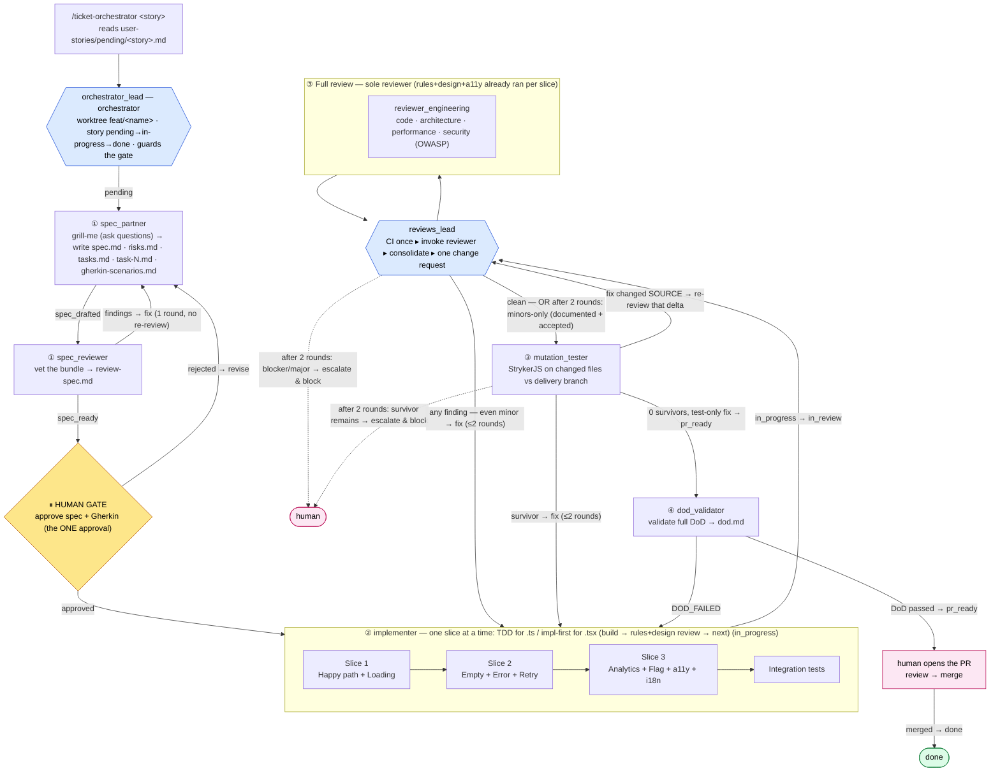

# Agentic Orchestrator Workflow — Implementation Plan

> **Superseded in part (2026-07-11, token-efficiency revision):** reviewer rubrics now live **in each reviewer's agent file** (`.agents/rules/review-standards.md` was removed); **`spec_partner` grills the human (asks questions) then writes the spec + Gherkin**; `spec_reviewer` vets them, and the human approves the **spec + Gherkin exactly once** (no separate plan-approval step); per-slice reviews run as a single combined `reviewer_slice` agent (rules + design + accessibility); **the full review has a single reviewer** — `reviewer_engineering` (code · architecture · performance · security) on Sonnet — with **design & accessibility handled per-slice by `reviewer_slice`** (not repeated in the full review); `reviews_lead` runs CI once per round and invokes that one reviewer; mutation runs **once, after the full review** (changed files vs the **delivery branch** `feature-entrega*`, never blind `main`) — the pre-review pass was removed, and the gate is **escalate-only** (never a fabricated PASS). Review artifacts are a **durable history** (kept, findings marked resolved — never emptied). Ops go through checked-in scripts (`bootstrap-worktree.sh`, `set-feature-phase.sh`, mutation helpers) — no hand-rolled `python3`/`sed`. Where this plan conflicts, `.agents/ORCHESTRATOR.md` wins.

> **Project:** AI Study Buddy (AI4Devs final project) — Turborepo + pnpm monorepo, Expo/React Native universal app, `@helsoft/*` libs, Supabase backend, Storybook + Playwright, Jest + RN Testing Library.
> **Goal:** A repeatable, gate-driven agentic orchestrator that takes a user story/ticket from the command line all the way to a merge-ready PR, following strict TDD, layered reviews, mutation testing, and a full Definition of Done.
> **Decisions locked in:** orchestrator lives under `.agents/` (extends existing folder) · mutation testing uses **StrykerJS** · pipeline driven by an **orchestrator agent** (`orchestrator_lead`) with a single human approval gate · each feature is built in its own **git worktree** on `feat/<name>` (`.worktrees/<name>`, gitignored) · **per-agent models** (via `model:` frontmatter): **Opus** for `spec_partner`, **Sonnet** for `orchestrator_lead` + `spec_reviewer` + `implementer` + `reviewer_slice` + `reviews_lead` + the full reviewer `reviewer_engineering`, **Haiku** for `mutation_tester` + `dod_validator`.

---

## 1. Where this comes from and what's different

This orchestrator blends two references:

- **`betta-tech/harness-sdd` (`uncle-bob-harness`)** — the "Uncle Bob" craftsman pipeline: *converse the spec → distill Gherkin → carve code with strict TDD → prune with judgment → validate with mutation testing*. Key ideas we keep: state lives on disk (not chat), one feature at a time, one human gate on the Gherkin contract, the "review is the whole game," and mutation testing as the real measure of whether tests bite. It is Python; we port the discipline to TypeScript.
- **`LIDR-academy/mobile-facephi`** — a ticket→PR mobile pipeline with per-stage contracts, explicit gates, `.claude/` commands + skills, a Design Translator, an Architecture guard, OWASP security, and a PR Guardian with a full DoD checklist. Key ideas we keep: per-stage artifacts in `docs/features/<id>/`, the reviewer/skill roles, the DoD checklist, and the ticket-driven entry point.

**How our flow differs from both:**

| Aspect | harness-sdd | mobile-facephi | **This orchestrator** |
|---|---|---|---|
| Entry | "implement next pending feature" | `/spec FEAT-XXX` | User-story `.md` file in `user-stories/pending/`, named on the command line (moved pending → in-progress → done as it runs) |
| Spec + Contract | `spec_partner` debates → `project-spec.md`; separate `gherkin_author` | `/spec` → spec + risks + tasks + qa | **`spec_partner` grills the human (asks questions) → writes** spec.md + risks.md + tasks.md + `gherkin-scenarios.md` (Gherkin via the `gherkin-authoring` skill); **`spec_reviewer` vets** them; then a **single human gate approves the spec + Gherkin** (no separate plan approval) |
| Build | `implementer` strict TDD | Code Agent by vertical slice | **`implementer`** by vertical slice (1→2→3): **TDD for non-UI `.ts`**, **implementation-first for UI `.tsx`** (impl → stories → interaction e2e → unit tests), always integration tests |
| Review | single `judge` | `/arch` + `/security` separately | **Two cadences:** per-slice light review (`reviewer_slice`, checks the slice against **all `.agents/rules/` + design + accessibility**) during the build, then a **single-reviewer full round** after all slices — `reviewer_engineering` (code · architecture · performance · security) — driven by **`reviews_lead`**, which runs CI once and turns the findings into one change request to the implementer (design & accessibility stay at the slice level) |
| Mutation | custom `mutate.py` | — | **StrykerJS** with per-feature score thresholds |
| DoD / PR | — | `/pr` PR Guardian (validates DoD **and** opens PR) | **`dod_validator`** — validates the full DoD only; PR creation is a manual human step |

The result is a 4-phase pipeline (below) driven by an orchestrator that guards the gates, keeps all state on disk, and stops for the human at **exactly one point** — `spec_partner` grills the human (asks questions) and writes the spec + Gherkin, `spec_reviewer` vets them, and the human approves the **spec + Gherkin once** — after which it runs autonomously up to a validated, PR-ready state. Opening and merging the PR stays a manual human step.

---

## 2. Target stack context (what the agents must respect)

Everything the orchestrator generates must obey the project's existing rules (canonical rules live in `.agents/rules/` and take precedence):

- **Monorepo layout** (`global.mdc`): code lives in `libs/*` as `@helsoft/*` packages; `apps/*` stay thin. A feature `app-x` pairs with a lib `libs/x`.
- **Layering** (`hooks-service-dao.mdc`): `Component → Hook → Service → DAO → Supabase / external API`. DAOs = data access only (Supabase DAO via `getSupabase()` or external-API DAO via `fetch`); Services = validation + business logic, no React; Hooks = React integration wrapping services never DAOs; data-fetching/mutation hooks use **tanstack-query** (`useQuery`/`useMutation`, one `QueryClient` via `QueryProvider`, mutation primitives exposed directly, errors normalized — `tanstack-query.mdc`). Every layer exports via `index.ts`. Related local state ≥3 fields → `useReducer` (`state.mdc`). Deep / large prop-drilling → React Context (`state-sharing.mdc`).
- **Components** (`atomic-design.mdc`): atoms → molecules → organisms → templates → pages. Component files in `component-name/component-name.tsx`, and **every component in a Storybook-enabled lib always ships a co-located `component-name.stories.tsx`** (no exceptions — a component without its story is incomplete). Use existing tokens/components; new Storybook stories follow `libs/lib-with-storybook/src/stories` patterns. Playwright e2e only for real interaction flows (`e2e.mdc`) — never render-only presence tests; unit tests own rendering/props/states.
- **Component file split** (`component-split.mdc`): non-trivial UI (organisms / complex molecules) splits into `*.tsx` (JSX + handlers) / `*.types.ts` / `use-*.ts` (local state) / `*.helpers.ts` (pure); not the data-layer hook.
- **Design / copy** (`.agents/DESIGN.md`): brand tokens, MD3 foundations, voice — reuse `libs/components/src/theme` and existing atoms/molecules; never hardcode color/spacing/radius.
- **i18n / labels** (`i18n.mdc`): user-facing text always via `t('namespace.key')` **inline at the usage site** — never a `labels` variable/object of pre-resolved `t()` calls; the only allowed collection is a **key dictionary** mapping a domain value → translation key (e.g. `GENERATION_ERROR_KEYS`).
- **Conventions**: functional React only, no Redux; always a `Props` type; kebab-case filenames; `.web.tsx` for platform-specific; Conventional Commits.
- **Testing** (`global.mdc` + `e2e.mdc`):
  - Storybook components → **Jest + React Native Testing Library** unit tests (`<name>.test.tsx`, co-located — rendering/props/states/handlers/a11y) **plus** **Storybook + Playwright** e2e **only when there is a real interaction** (`e2e.mdc` — never a render-only "it renders" e2e; no interaction → no `.e2e.js`). E2e live under `tests/e2e/`, mirroring the component's `src/` path; stories reached via `/?path=/story/...` inside `frameLocator('iframe[title="storybook-preview-iframe"]')`; components port 6007, lib-with-storybook 6006. The orchestrator **requires the Jest unit test on every component** so **mutation testing** applies to UI too — though for `.tsx` those unit tests are written **last** (implementation-first order), not test-first; only non-UI `.ts` is TDD (`tdd.mdc`).
  - Hooks/services/DAOs/non-Storybook components → **Jest + React Native Testing Library** (`*.dao.test.ts`, `*.service.test.ts`, `*.test.ts`).
  - Supabase queries → **Supabase Test Helpers**.
- **Backend**: Supabase; schema changes via migrations (`npx supabase migration new`, `npx supabase db push`).

> ✅ **Test tooling status:** Jest + RN Testing Library is **already configured** across `@helsoft/components` (`jest-expo`), `@helsoft/hooks`, `@helsoft/services`, and `@helsoft/supabase-services` (`ts-jest`), each with a `test: jest` script; Playwright is installed at the root. The only Phase 0 gap is **StrykerJS** (not yet installed) and, if needed, **Supabase Test Helpers**.

---

## 3. Directory layout (all under `.agents/`)

We extend the existing `.agents/` folder rather than introducing `.claude/`. Orchestration and agent role definitions are added; rules stay where they are.

```
.agents/
├── rules.md                      # existing — index of rules
├── rules/                        # passive standards (always-on reference)
│   ├── global.mdc
│   ├── hooks-service-dao.mdc
│   ├── tanstack-query.mdc        # useQuery/useMutation in @helsoft/hooks (one QueryClient, mutation primitives, error guard, waitFor tests)
│   ├── atomic-design.mdc
│   ├── component-split.mdc
│   ├── types.mdc                 # existing — multi-file types live in *.types.ts
│   ├── state.mdc                 # ≥3 related local states that change together → useReducer
│   ├── state-sharing.mdc         # React Context to avoid deep / large prop-drilling
│   ├── i18n.mdc                  # NEW — t('ns.key') inline, no labels object (key dictionaries excepted)
│   ├── tdd.mdc                   # NEW — Three Laws of TDD, Red-Green-Refactor for TS
│   ├── pre-slice-checklist.mdc   # NEW — recurring pre-slice self-check (barrels, helpers, a11y, atom ban, Modal, e2e, layout, i18n)
│   └── e2e.mdc                   # NEW — Playwright e2e are interaction-only (no render-only presence tests)
│                                 #   (reviewer rubrics now live inline in each reviewer agent file — no shared review-standards doc)
├── DESIGN.md                     # brand/design system (colors, type, voice, MD3; not a .mdc rule file)
├── skills/                       # invocable procedures (loaded on demand)
│   ├── grill-me/                 # relentless one-question-at-a-time interview (runs /grilling) — used by spec_partner
│   ├── gherkin-authoring/        # NEW — distill spec → tagged gherkin-scenarios.md contract
│   ├── mutation-testing/         # NEW — StrykerJS scoped to changed files (+ scripts/run-mutation.sh)
│   ├── storybook-e2e-tests/      # existing — Playwright e2e for Storybook components (owns the .e2e.js location)
│   └── compact-docs/             # NEW — pre-PR: script drops stray review copies + size report (script only, no agent) (+ scripts/compact-docs.sh)
├── commands/                     # existing (commit.md) — thin CLI entry points
│   ├── ticket-orchestrator.md    # NEW — /ticket-orchestrator <story> → reads user-stories/<story>.md, invokes orchestrator_lead
│   └── commit.md
├── agents/                       # NEW — role definitions (subagents)
│   ├── orchestrator_lead.md      # orchestrator: guards phases + the gate, invokes others
│   ├── spec_partner.md           # Phase 1 — grill (ask questions) → write spec + Gherkin contract
│   ├── spec_reviewer.md          # Phase 1 — pre-gate review of the written spec bundle
│   ├── implementer.md          # Phase 2 (+ change re-work in Phase 3)
│   ├── reviewer_slice.md         # Phase 2 — per-slice review vs. all .agents/rules/ + design + accessibility (one agent)
│   ├── reviews_lead.md           # Phase 3 — CI once, invokes the sole full reviewer, consolidates, requests changes
│   ├── reviewer_engineering.md   # Phase 3 (full review, sole reviewer) — code · architecture · performance · security
│   ├── mutation_tester.md        # Phase 3 (StrykerJS — runs once, after the full review)
│   └── dod_validator.md          # Phase 4 (validates DoD only; does not open the PR)
├── templates/                    # NEW — per-feature doc templates copied at Phase 1
│   ├── spec.md
│   ├── risks.md
│   ├── tasks.md                  # task index (feature-level status + task table)
│   ├── task.md                   # single-task template (copied as task-1.md, task-2.md, …)
│   └── dod.md                    # DoD validation report template
└── ORCHESTRATOR.md               # NEW — source of truth: roles, contracts, gates, DoD

user-stories/                     # EXISTING — input tickets; a kanban of folders the orchestrator moves stories through
├── pending/<story>.md            # authored here (via /create-user-story or by hand)
├── in-progress/<story>.md        # orchestrator git-mv's here on start (step 1)
└── done/<story>.md               # orchestrator git-mv's here when pr_ready (hand-off)

docs/
└── features/
    └── <name>/                   # ONE folder per feature — everything for it lives here
        ├── spec.md               # spec_partner
        ├── tasks.md              # spec_partner — task INDEX: feature-level status + task table
        ├── task-1.md             # spec_partner — one file per task (replaces feature_list.json)
        ├── task-2.md             #   each carries its own frontmatter status + slice + scenarios
        ├── …                     #   task-N.md
        ├── gherkin-scenarios.md        # spec_partner — the Gherkin contract (via gherkin-authoring skill)
        ├── review-spec.md        # spec_reviewer — pre-gate spec-bundle review (durable findings trail; never empty)
        ├── tdd.md                # implementer — TDD cycle log + @scenario → test map
        ├── review-engineering.md # reviewer_engineering — the sole full-review report
        ├── review.md             # reviews_lead — consolidated findings + change requests + round verdict
        ├── mutation.md           # mutation_tester — StrykerJS score + surviving mutants
        ├── dod.md                # dod_validator — DoD validation report (pass/fail + evidence)
        └── risks.md              # spec_partner — LANDS HERE ONLY AT PR TIME (moved from tmp/<name>/)

tmp/                              # NEW (gitignored) — orchestrator scratch, never re-read into context
└── <name>/
    └── risks.md                 # spec_partner writes it here; lead moves it to docs/features/<name>/ at PR prep

progress/                         # NEW — session-level state only (nothing feature-named)
├── current.md                    # pointer to the active feature/task
└── history.md                    # append-only log of completed features

.worktrees/                       # NEW (gitignored) — one git worktree per feature
└── <name>/                       # branch feat/<name>; ALL work runs here; removed after the PR merges
```

**No global state file.** The old `feature_list.json` is gone. The set of features is simply the set of folders under `docs/features/`; "one feature at a time" means `progress/current.md` points at the active one. Per-feature state now lives in that feature's folder:

- **`tasks.md`** — an index with the feature-level pipeline phase in frontmatter and a table of its tasks.
- **`task-N.md`** — one file per atomic task, each with frontmatter:

  ```markdown
  ---
  id: task-2
  title: Render error + retry for lesson list
  slice: 2                 # vertical slice 1 | 2 | 3
  scenarios: [s3, s4]      # @s tags from gherkin-scenarios.md this task satisfies
  status: todo             # todo | in_progress | in_review | done
  paths: [libs/components/src/organisms/lesson-list/…]
  ---
  ## Goal / Done criteria / Notes
  ```

**Feature pipeline phase** (frontmatter `status:` in `tasks.md`, guarded by `orchestrator_lead`):

```
pending → [spec_partner: grill (ask questions) → write the bundle] → spec_drafted
        → [spec_reviewer once on the written bundle → spec_partner fixes every finding, 1 round] → spec_ready
        → [HUMAN GATE: approve spec + Gherkin — the ONE approval] → approved
        → in_progress → in_review → mutation → pr_ready
        → [human opens & merges PR] → done
```

Only `orchestrator_lead` (and `implementer` on final `done`) writes the feature phase; the implementer flips individual `task-N.md` statuses as it builds. **One human approval**: `spec_partner` grills the human (asks questions) and writes the bundle (`spec_drafted`), `spec_reviewer` vets it (`spec_ready`), and the human approves the **spec + Gherkin once** (`spec_ready → approved`) — no separate plan approval. Everything after the gate runs autonomously up to `pr_ready`; `dod_validator` only validates the DoD — opening and merging the PR is a manual human step that moves the feature to `done`.

---

## 4. Pipeline overview

One feature at a time. State on disk. Exactly one human approval — after `spec_partner` grills and writes the spec + Gherkin and `spec_reviewer` vets them, the human approves the **spec + Gherkin once**. Edge labels show the feature status written after each step.



*State transitions written by `orchestrator_lead`: `pending → spec_drafted → spec_ready → approved → in_progress → in_review → mutation → pr_ready`. The human then opens and merges the PR → `done`.*

---

## 5. Phase-by-phase agent contracts

Each agent is a Claude Code subagent defined in `.agents/agents/<name>.md` with YAML frontmatter (`name`, `description`, `tools`). Sub-agents write results to disk and return **one reference line** to the lead — diffs and reports never travel through chat.

### Phase 1 — `spec_partner` (Spec + Gherkin contract, one step)
- **Tools:** `Read, Write, Glob, Grep`.
- **Input:** the user-story markdown file (the lead moves it to `user-stories/in-progress/<story>.md` before invoking; named on the CLI: `/ticket-orchestrator <story>`), plus any screenshot or API spec it references, plus `PRD.md` for product context.
- **Behavior:** Read the ticket, then **grill the human** using the `grill-me` skill (`.agents/skills/grill-me/` → `/grilling`): a relentless, one-question-at-a-time interview with a recommended answer per question, resolving decision dependencies until the spec is unambiguous (recording decisions *with their rationale*; facts are looked up, decisions are the human's). **Any new library, new architecture, or structurally significant change is always put to the human explicitly** — never decided silently. Then, in the **same step**, distill the spec into the Gherkin contract using the `gherkin-authoring` skill.
- **Outputs (in `docs/features/<name>/`):**
  - `spec.md` — a terse **overview**: summary, user stories ("As a … I want … so that …"), the 4 UI states (Loading / Content / Error / Empty) where UI is involved, analytics events, feature flags, non-goals, resolved decisions. **Acceptance criteria are NOT here** — the `@s` scenarios in `gherkin-scenarios.md` are the ACs; `spec.md` links to them. As a **final Phase 1 step, `spec_partner` re-reads and shrinks `spec.md`** (once the tasks + Gherkin exist) so it duplicates nothing they own — no behavior detail (→ gherkin), no task/impl detail (→ `task-N.md`), no risk write-ups (→ `risks.md`); target ≤ ~4 KB. `spec_reviewer` flags any leftover duplication.
  - `risks.md` — technical / product / timeline risks, each with a mitigation. **Written to the gitignored `tmp/<name>/` folder, NOT `docs/features/<name>/`** — it is never re-read into context during the run and is out of the review bundle; `orchestrator_lead` moves it into `docs/features/<name>/` at PR prep (step 11) so it ships in the PR.
  - `tasks.md` — the task **index**: feature-level pipeline status (frontmatter) + a table linking to each `task-N.md`, grouped by vertical slice.
  - `task-1.md`, `task-2.md`, … — one file per atomic task (replaces the old `feature_list.json`), each with frontmatter (`id`, `title`, `slice`, `scenarios`, `status`, `paths`) and a goal/done-criteria body.
  - `gherkin-scenarios.md` — the Gherkin contract, distilled from the spec **in the same step** via the `gherkin-authoring` skill: one `@s`-tagged `Scenario` per behavior (happy path + error/empty/edge), every AC mapped to ≥ 1 scenario, each `task-N.md`'s `scenarios` referencing the `@s` tags. Ambiguity is resolved here — the point of maximum leverage — not in code.
- **Gate → `spec_drafted`:** every AC is testable (G/W/T); 4 UI states defined (if UI); risks have mitigations; every AC maps to an `@s` scenario in `gherkin-scenarios.md`; tasks map to `libs/*` paths that respect the layering rules.

**Phase 1 (review) — `spec_reviewer` (automated, pre-gate — on the written bundle)**
- **Tools:** `Read, Glob, Grep`. Reviews the **documents**, never writes them.
- **Behavior:** independently vet the bundle (`spec.md`, `tasks.md`, `task-N.md`, `gherkin-scenarios.md` — **not `risks.md`, which lives in `tmp/<name>/` and is out of scope**) for correctness, completeness, testability, valid `libs/*` task paths, full story → AC → `@s` → task traceability, and that **`spec.md` is a terse overview that duplicates nothing** in the linked files (rubric inline in `spec_reviewer.md`). Write `review-spec.md`.
- **Single round:** `spec_reviewer` reviews the written bundle **once**; `spec_partner` fixes **every** finding; then → `spec_ready` (no re-review pass). A finding `spec_partner` can't resolve → the lead **escalates** to the human. This is automated — not a human approval.
- **⏸ HUMAN GATE (single — the pipeline's only human approval):** `orchestrator_lead` presents **`spec.md` and `gherkin-scenarios.md` together** and **waits for one explicit approval** of the spec + contract. The human can send edits back to `spec_partner` (revise + re-run the automated review) or approve → `approved`. There is **no separate plan-approval step** — the grilling questions are the alignment, and the written spec + Gherkin are the one thing the human signs. It's the cheapest place to correct scope, intent, and contract before building.

### Phase 2 — `implementer` (Build — TDD for non-UI `.ts`, implementation-first for UI `.tsx`)
- **Tools:** `Read, Write, Edit, Glob, Grep, Bash`.
- **Preconditions:** feature is `approved`; `docs/features/<name>/gherkin-scenarios.md` exists. Otherwise stop. Reads the feature's `task-N.md` files and works them in slice order, flipping each task's `status` (`todo → in_progress → done`) as it goes.
- **Discipline by file type (`tdd.mdc`):** **non-UI `.ts`** (services/DAOs/hooks/`*.helpers.ts`/`*.reducer.ts`/pure logic) is **strict TDD** — the Three Laws: (1) no production code except to pass a failing test; (2) no more test than needed to fail (not compiling counts as failing); (3) no more production than needed to pass; cycle **Red → Green → Refactor**, one `@s` at a time. **UI `.tsx`** is **implementation-first** (not test-first): impl → stories → interaction e2e → unit tests (see the artifact block below). Log each `.ts` cycle and each UI artifact + the `@s → test` map to `docs/features/<name>/tdd.md`.
- **Vertical slices (build in this order, one slice at a time):** the feature is delivered as thin end-to-end slices, each shippable and each its own mini TDD loop. The implementer does **not** start Slice 2 until Slice 1's slice-gate passes. Scenarios (`@s`) from the `gherkin-scenarios.md` are grouped onto slices in `tasks.md`.

  | Slice | Scope | Scenarios it covers | Conventional commit |
  |---|---|---|---|
  | **1 — Happy path + Loading** | Core success flow end-to-end (UI Loading→Content, wired through hook→service→DAO) | the primary `@s` happy-path scenarios | `feat(<name>): implement happy path` |
  | **2 — Empty + Error + Retry** | Empty and Error UI states, retry action, error handling by failure type (e.g. Supabase/API error, 401→refresh, 429→backoff) | the error/empty `@s` scenarios | `feat(<name>): add error handling and empty state` |
  | **3 — Analytics + Flag + a11y + i18n** | Instrument analytics events, wrap in feature flag (if rollout), accessibility labels/roles, strings externalized | the observability/a11y `@s` scenarios | `feat(<name>): add analytics, a11y, and i18n` |

  **Per-slice gate** (before the commit and before the next slice): the slice's `@s` scenarios are covered by passing tests; `pnpm --filter <ws> test` (+ relevant `test:e2e`) green; `pnpm lint` + `pnpm check-types` clean; no hardcoded strings/colors/dims; **and a light `reviewer_slice` review (checks the slice against all `.agents/rules/` + design + accessibility, invoked directly by `orchestrator_lead`)** runs — **1 round**: reviews once, findings fixed via TDD, no re-review (unresolvable → escalate). Then the Conventional Commit is made. Each slice is logged as its own block in `docs/features/<name>/tdd.md`. Non-UI/logic-only features still slice by risk (happy path → error/edge → observability) even without the 4 UI states.
- **What it generates within each slice, by artifact type:**

  **a. UI component** (`.tsx`, Storybook-backed, atomic design) — **implementation-first, in this order** (NOT test-first):
  1. **Component:** `libs/<lib>/src/<atoms|molecules|organisms|templates|pages>/<name>/<name>.tsx` — **always reuse existing tokens/components**; if the story references a pasted screenshot, translate it to the design system, otherwise build from the spec. (No Figma in this repo — no Figma MCP step.) Its co-located `.ts` (`use-<name>.ts`, `<name>.helpers.ts`, `<name>.reducer.ts`) is still **TDD'd test-first**.
  2. **Story:** `<name>.stories.tsx` (follow `lib-with-storybook` patterns; cover the 4 states).
  3. **Interaction e2e:** `<name>.e2e.js` under `tests/e2e/` (Playwright against the story) — **only for real interaction flows** (`e2e.mdc`; a component with no interaction gets none). (Playwright is outside Stryker's scope.)
  4. **Unit tests last — still REQUIRED for every component** (`<name>.test.tsx`, Jest + RN Testing Library, co-located): rendering per prop, each of the 4 UI states, conditional branches, callback/handler wiring, accessibility roles/labels. Owns static rendering/presence, and is what makes the `.tsx` **mutation-testable** (mutation runs later, after all slices).

  **b. Logic / business rules** (hooks / services / DAOs):
  - Unit tests first: `*.service.test.ts`, `*.dao.test.ts`, `use-*.test.ts` (mock Supabase `getSupabase()`/`fetch` or the layer below).
  - Implementation following the `Component → Hook → Service → DAO` layering, exported through the barrels.

  **c. Always:** an **integration test** exercising the vertical slice end-to-end across layers (e.g., hook→service→DAO with a mocked Supabase client, or a Playwright flow across composed components).
- **Feature gate → `in_review` (after all slices):** every `@s` covered by ≥1 concrete test across the slices; the integration test green; `pnpm --filter <ws> test` and relevant `test:e2e` green; `pnpm lint` and `pnpm check-types` green; no scope beyond the contract; no hardcoded strings/colors/dims. The implementer does **not** self-mark `done`. (Two review cadences: `reviewer_slice` (checks the slice against all `.agents/rules/` + design + accessibility) runs **per slice** as a fast gate; then, once after all slices, the **quality gate** runs — **single-reviewer full round → mutation** — the full review (`reviewer_engineering`: code · architecture · performance · security) runs once, then a single compute-bound mutation pass after it.)
- **Re-work loop:** the post-build **quality gate** is an ordered sequence — full review → mutation. Each is its own loop (≤ 2 rounds) that routes work to `implementer`: `reviews_lead` hands back one consolidated change request holding **every** finding (any severity, incl. minor); then `mutation_tester` hands back surviving mutants (kill via a stronger test). **If a mutation fix changes production source (not just tests), the full review re-runs on that delta** (bounded); a test-only mutation fix skips the re-review. `review.md` keeps the full findings trail.

### Phase 3 (full review) — Reviewers (the review is the whole game)
> Followed by mutation: `mutation_tester` runs **once, after** this full review (see "Phase 3 (mutation)" below).
This is the **full review**, run once after all slices (during the build, `reviewer_slice` already enforced every rule in `.agents/rules/` + the design and accessibility lenses per slice — so **design & accessibility are not repeated here**). The remaining lenses are handled by a **single reviewer**, an independent subagent with `Read, Glob, Grep, Bash` only (**it never edits code** — it prunes, it doesn't patch):

```
reviewer_engineering → review-engineering.md  [code] quality, TDD discipline, scenario coverage · [arch] layering (Component→Hook→Service→DAO), no cross-layer/DTO leaks, no unapproved deps · [perf] re-renders, memoization, list virtualization, N+1/round-trips, bundle weight · [security] OWASP Top 10 + MASVS: secrets, input validation, no PII in logs, TLS, Supabase RLS/auth
```

Each reviewer runs its rubric (inline in its agent file), judges the diff against the lead-provided CI status (it never re-runs lint/type/test itself), self-marks any sub-lens the diff can't trigger as `N/A`, and writes `APPROVED` or `CHANGES_REQUESTED` with concrete `file:line` findings (tagged by lens) to its own report file, returning a one-line verdict.

**`reviews_lead`** (tools: `Read, Write, Glob, Grep, Bash, Task`; never edits code) orchestrates the whole review round:
1. CI once, then invoke the reviewer: run lint/type/test (+ e2e where relevant) once, then invoke `reviewer_engineering` with the CI status. It always runs (code + architecture always apply) and self-marks performance and/or security `N/A` when the diff can't trigger them (recorded in `review-engineering.md`).
2. Consolidate: read `review-engineering.md` and write the verdict + a single ordered change-request list (blocker → major → minor) to `docs/features/<name>/review.md`.
3. Verdict — **any finding blocks**: only if there are **zero findings of any severity** → report `APPROVED`. If **any** finding remains — **blocker, major, OR minor** → issue **one change request** to `implementer`, which fixes **every** item via TDD. There is no "approve with minor findings left open."
4. Re-review (round 2): after `implementer` fixes via TDD, `reviews_lead` re-runs CI once and re-runs `reviewer_engineering` over the fix diff, then re-consolidates, **pruning `review.md` to only the findings still open**. (Mutation is **not** part of this loop — `mutation_tester` runs once **after** this full review.)
5. **Round cap:** at most **2 rounds**. After the 2nd round, a remaining **blocker/major** is **hard** — escalate and block. If **only minors** remain, they may ship as **documented, human-accepted** risks (recorded in `review.md`, `spec.md` Open decisions, `dod.md`). `review.md` retains the **full findings trail** (each item marked resolved/open, plus any accepted minors) — **never emptied**, even on a clean exit; `dod_validator` fails a 0-byte review file.

`reviews_lead` runs CI once (so the reviewer judges the diff, not the world) and owns `review.md` + the ≤ 2-round loop; `reviewer_engineering` is the single point of judgment. Design & accessibility already ran per slice via `reviewer_slice`.

**Reviewer hard rules:** never approve with failing tests/lint/types (use the lead's CI status; never re-run suites); be specific (`file:line`, no generic feedback); never edit code.

### Phase 3 (mutation) — `mutation_tester` (StrykerJS, once after the full review)
- **Tools:** `Read, Glob, Grep, Bash`. **Measures only; never edits code.**
- **Runs once, after the full review**, over the feature's changed files (vs the **delivery branch**, never blind `main`) — so it covers the code the review just fixed as well as the original build. **Escalate-only:** unmet after ≤ 2 kill rounds → `ESCALATE`; never a fabricated PASS.
- **Conditional re-review:** after the survivors are killed, the lead checks the fix diff. If it changed **production source** (`libs/*/src` `.ts`/`.tsx`, excluding tests/stories/e2e) → the **full review re-runs** on that delta (bounded; re-run mutation if the review changes source). If the fix was **test-only** (a strengthened assertion changes no behavior) → no re-review, straight to DoD.
- **Tool:** StrykerJS (`@stryker-mutator/core` + `@stryker-mutator/jest-runner`, plus the TS checker). Config per workspace (`stryker.config.mjs`) scoped to the feature's changed files via `mutate: [...]`.
- **Behavior:** run Stryker over the feature's new/changed source; report `killed / survived / score` and each surviving mutant to `docs/features/<name>/mutation.md`.
- **Threshold:** **100% killed on the lines new/changed by this feature** (matching the reference repo's intent); legacy untouched code is measured, not blocked. An *equivalent* mutant may be excluded **only** with a written justification in the report.
- **Loop:** any survivor → back to `implementer` (kill it — prefer a stronger **test**; touch source only for a real defect) → re-run Stryker, capped at **2 rounds** (unresolved survivors → escalate & block). Then the conditional re-review above: source-changing fix → full review re-runs on that delta; test-only fix → straight to `dod_validator`.

Stryker runs on **every workspace that ships changed source — including `libs/components`** — since UI components now carry Jest unit tests. Example `stryker.config.mjs`:
```js
// libs/services — REST logic; libs/supabase-services — Supabase logic
export default {
  packageManager: 'pnpm',
  testRunner: 'jest',
  jest: { projectType: 'custom', configFile: 'jest.config.js' },
  checkers: ['typescript'],
  tsconfigFile: 'tsconfig.json',
  reporters: ['html', 'clear-text', 'progress'],
  coverageAnalysis: 'perTest',
  mutate: ['src/services/<feature>.service.ts', 'src/dao/<feature>.dao.ts'],
  thresholds: { high: 100, low: 100, break: 100 }, // break the run below 100% on changed files
};

// libs/components — UI: mutate the component source, bitten by <name>.test.tsx
// mutate: ['src/**/<name>/<name>.tsx']   // excludes *.stories.tsx and *.e2e.js
```

### Phase 4 — `dod_validator` (Definition of Done validation)
- **Tools:** `Read, Glob, Grep, Bash`. **Validates only — it does not create branches, commits, or the PR.**
- **Behavior:** run the **complete DoD** (Section 7) against the implemented feature and write a pass/fail report to `docs/features/<name>/dod.md` — every DoD item marked `[x]`/`[ ]` with concrete evidence (command output, `file:line`, links to `review.md` / `mutation.md`). It re-runs the objective checks itself (lint, types, unit/integration/e2e suites, mutation threshold) rather than trusting prior reports. If any item fails, it returns `DOD_FAILED` and `orchestrator_lead` routes the gap back to `implementer`; it never patches code itself.
- **Gate → `pr_ready`:** every DoD item checked and passing; all suites green; mutation threshold met; reviewers all APPROVED. Opening the PR is a **manual human step** after `pr_ready`; merging the PR is what moves the feature to `done`.

---

## 6. Orchestrator — `orchestrator_lead`
- **Tools:** `Read, Write, Glob, Grep, Bash, Task` (it invokes subagents; it does **not** implement or edit feature code).
- **Responsibilities:** create the feature's **git worktree** on `feat/<name>` (`.worktrees/<name>`) and run everything inside it (never on the main checkout); own the feature folders under `docs/features/` (task statuses + feature phase in `tasks.md`) and `progress/current.md`; enforce one feature at a time; run phases in order; **stop at the single human gate** (approve the written spec + Gherkin — the pipeline's one human approval) and loop edits back to `spec_partner` until approved; delegate the whole review phase to `reviews_lead` (which runs CI once, invokes the sole full reviewer `reviewer_engineering`, consolidates, and loops changes with the implementer); route surviving mutants back to `implementer`; append to `progress/history.md`. It never lets a phase advance until its gate passes.
- **Entry:** the `/ticket-orchestrator <story>` command (`.agents/commands/ticket-orchestrator.md`) sets the role, resolves `$ARGUMENTS` to `user-stories/<story>.md`, and reads it as the ticket.

**Anti-"telephone" rule:** subagents persist artifacts to disk and return a single reference line (e.g. `green -> docs/features/<name>/tdd.md`, `CHANGES_REQUESTED -> docs/features/<name>/review.md`). Content lives on disk, surviving restarts and blown context windows.

---

## 7. Definition of Done (checked by `dod_validator`)

**Functionality** — all ACs met; 4 UI states implemented (if UI); robust error handling, no undefined states.
**Code quality** — `pnpm lint` + `pnpm check-types` clean; unit + integration + e2e green; no TODOs without an issue; Conventional Commits.
**Architecture** — `Component→Hook→Service→DAO` respected; no cross-layer imports; DTOs not leaked out of `data`/DAO; no unapproved dependencies; barrels updated.
**Design system** — tokens/existing components reused; correct atomic-design placement; Storybook stories for every shared component (4 states); every component has a Jest unit test (`<name>.test.tsx`).
**Security (OWASP)** — no secrets/keys in code or logs; inputs validated; Supabase RLS/auth respected; no PII in logs; TLS for external calls.
**Accessibility (WCAG 2.2 AA)** — labels/roles present; contrast ≥ 4.5:1; touch targets ≥ 44/48; sensible focus order; dynamic type.
**Testing rigor** — every `@s` scenario covered; every component and logic unit has Jest unit tests; **mutation score threshold met** on all changed source (component `.tsx` included).
**Observability & i18n** — analytics events per spec; feature flag wrapping if applicable; no hardcoded user-facing strings — all via `t('ns.key')` inline, no `labels` object (`i18n.mdc`).

---

## 8. Implementation roadmap

**Phase 0 — Foundations (prerequisite)**
1. **Jest + RN Testing Library is already configured** in `@helsoft/services`, `@helsoft/supabase-services`, `@helsoft/hooks`, `@helsoft/components` (each has a `test: jest` script). Just confirm the Turbo `test` task fans out to them, and add **Supabase Test Helpers** for DB query tests if not already present. (Note: `libs/study-buddy` and `apps/*` have no `test` script yet — add one when they first get tests.)
2. Install **StrykerJS** (`@stryker-mutator/core`, `@stryker-mutator/jest-runner`, `@stryker-mutator/typescript-checker`) at the root as a dev dependency; add a `stryker.config.mjs` template per lib and a `mutation` Turbo task.
3. Create `progress/` (`current.md` + `history.md`) and `docs/features/` with `.gitkeep`. No global state file — each feature gets its own folder with `tasks.md` + `task-N.md`. Add `.worktrees/` to `.gitignore` (the orchestrator creates a per-feature worktree there).

**Phase 1 — Author the orchestrator docs & rules**
4. Write `.agents/ORCHESTRATOR.md` (source of truth: roles, contracts, gates, DoD, state machine).
5. Write rule `.agents/rules/tdd.mdc` (reviewer rubrics live inline in each reviewer agent file — no shared review-standards doc), and skills `.agents/skills/{gherkin-authoring,mutation-testing}/` (mutation-testing bundles `scripts/run-mutation.sh`).
6. Add per-feature templates in `.agents/templates/` (spec, risks, tasks, pr).

**Phase 2 — Define the agents**
7. Write the 9 role files in `.agents/agents/` (orchestrator_lead + spec_partner + spec_reviewer + implementer + reviewer_slice + reviews_lead + the full reviewer `reviewer_engineering` + mutation_tester + dod_validator), each with frontmatter, tools, protocol, gates, and hard rules — ported from the reference agents but adapted to this stack.
8. Write `.agents/commands/ticket-orchestrator.md` (the `/ticket-orchestrator <story>` entry that reads `user-stories/<story>.md`) and update `.agents/rules.md` / `CLAUDE.md` to point at `AGENTS.md`.

**Phase 3 — Dry run & verification**
9. Run the orchestrator on a small real ticket (e.g. a new atom component and a small service) end-to-end; confirm each gate fires, the human gate stops correctly, reviewers loop, and Stryker enforces the threshold.
10. Capture the run's artifacts (the whole `docs/features/<name>/` folder) as the reference example, mirroring how `cli_count` is shipped in harness-sdd.

**Suggested build order:** Phase 0 → AGENTS.md + rules → agents (lead first, then spec/gherkin, then implementer, then reviewers, then mutation, then pr) → command → dry run.

---

## 9. Decisions & remaining risks

Resolved (locked in):

- **Ticket source & lifecycle — RESOLVED:** tickets are markdown files in `user-stories/`, organized as a folder kanban: authored in `pending/`; the orchestrator `git mv`s the story to `in-progress/` when it starts (step 1) and to `done/` when the feature reaches `pr_ready` (hand-off), committed on `feat/<name>`. No tracker MCP needed.
- **Figma access — RESOLVED:** no Figma in this repo. `implementer` builds UI from the spec, or from a pasted screenshot if the story includes one. No Figma MCP step.
- **Jest / Expo SDK 57 / RN 0.86 / React 19 — RESOLVED:** already configured (`jest-expo` in `@helsoft/components`, `ts-jest` in `@helsoft/hooks`/`@helsoft/services`/`@helsoft/supabase-services`). Phase 0 only adds StrykerJS (+ Supabase Test Helpers if missing).
- **Review & mutation sequencing — RESOLVED:** after all slices, the quality gate runs **full review → mutation** (the separate pre-review mutation pass was removed). Each is its own ≤ 2-round loop routing fixes to `implementer`; the single mutation pass runs after the review on the feature's changed files (vs the **delivery branch**), so it covers the review's fixes too; the gate is **escalate-only** (unmet after 2 rounds → `ESCALATE`, never a fabricated PASS). **A mutation fix that changes production source re-triggers the full review on that delta** (bounded, re-running mutation if the review changes source); a **test-only** mutation fix (strengthened assertion, no behavior change) skips the re-review. In the full review `implementer` fixes **every** finding (any severity, incl. minor); after the 2-round cap, blockers/majors → escalate & block, while **minors-only may ship as documented, human-accepted risks** (recorded in `review.md`, `spec.md` Open decisions, `dod.md`).
- **e2e vs mutation — RESOLVED:** Stryker's Jest runner won't cover Playwright `.e2e.js` visual tests; mutation thresholds apply to Jest-testable code (services/hooks/DAOs **and** component logic/behavior), while Playwright guards rendered/visual behavior. This split is documented in the `mutation-testing` skill (`.agents/skills/mutation-testing/SKILL.md`).
- **Mutation scope & cost — RESOLVED:** always mutate **only the feature's changed files** (changed services/DAOs/hooks + changed component `.tsx`) with `coverageAnalysis: 'perTest'`. No global mutation runs. This is the accepted cost/coverage tradeoff — it keeps Stryker affordable even though it's the slowest gate and rendering-based component tests add runtime.

- **Artifact hygiene / token budget — RESOLVED:** per-feature `.md` files are kept small and deduplicated (see `.agents/ORCHESTRATOR.md` §Artifact hygiene): ACs live only in `gherkin-scenarios.md` (spec links, doesn't copy) and `spec_partner` **shrinks `spec.md` to a ≤ ~4 KB overview** as its final Phase-1 step, once the tasks exist; `tasks.md` is a bare index (per-task frontmatter is authoritative); `tdd.md` is a `@s → test` map + one line per cycle (no pasted code/diffs); each reviewer keeps **one** `review-<type>.md` updated each round to a **durable findings trail** (fixed items marked resolved, never emptied; no `-r2`/`-r3` proliferation), with `review.md` the single durable consolidated record — **review history is kept forever** for retros, never pruned to 0-byte; `dod.md` cites `review.md`/`mutation.md` rather than restating; `progress/*` entries are one line. **`risks.md` is kept out of context entirely** — `spec_partner` writes it once to a gitignored `tmp/<name>/` folder, it is never re-read during the run (not part of the review bundle, not read by any agent), and `orchestrator_lead` moves it into `docs/features/<name>/` only at PR prep (step 11) so it still ships in the PR. A final **`compact-docs`** step (orchestrator step 10, after DoD PASS and before hand-off) runs **only** `scripts/compact-docs.sh` — it deletes stray per-round review copies and prints a size report; **no agent/subagent trimming** (docs are written terse up front, so there's nothing to summarize post-hoc). **Broader token levers:** read the `git diff` not whole files; state on disk + one-line agent handoffs (anti-telephone); model tiering (Haiku for mechanical steps); prune-as-you-go so re-reads shrink each round.

No outstanding open questions — all resolved.

---

*This document is a plan only. No orchestrator files have been created yet — Phase 0 onward are the next steps once the plan is approved.*
