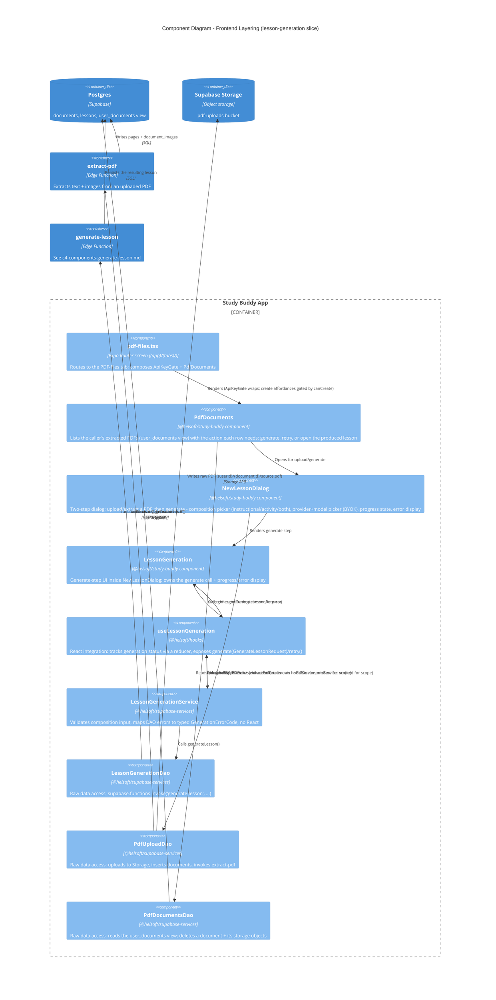

# C4 — Component Diagram: Frontend Layering (Study Buddy App)

Level 3. Audience: developers. Zooms into the `Study Buddy App` container from
[c4-containers.md](./c4-containers.md) to show the layering enforced repo-wide by
`.agents/rules/hooks-service-dao.mdc`:

```
Component → Hook → Service → DAO → Supabase / Edge Function
```

This diagram uses the **lesson generation** vertical slice as the representative example — the
same pattern repeats for every feature (auth, PDF upload, lessons list, lesson attempts, API
key management, provider catalog), each with its own Component/Hook/Service/DAO set.



## Notes

- **DAOs never appear in components.** Rel arrows to DAOs are shorthand — the real chain is
  component → hook → service → DAO (`hooks-service-dao.mdc`). Upload goes through its own
  hook/service (omitted for scope) into `PdfUploadDao`; generate goes
  `LessonGeneration` → `useLessonGeneration` → `LessonGenerationService` →
  `LessonGenerationDao`. `ApiKeyGate` always mounts children and only surfaces a notice when
  `!canCreate`; create/upload affordances gate on `useProfile().profile?.canCreate` inside
  `PdfDocuments`. Reviewers (`reviewer_slice`) check the layering rule on every slice.
- **Two DAO backends behind the same pattern.** `LessonGenerationDao` and `PdfUploadDao`
  invoke Edge Functions; other DAOs in the same lib (e.g. `LessonsDao`, `LessonAttemptDao`,
  `AiProvidersDao`, `PdfDocumentsDao`) talk to Postgres/Storage directly via PostgREST. The
  Hook/Service layers above them don't need to know which — that's the point of the DAO
  boundary.
- **State shape.** Service-backed hooks use TanStack Query (`useQuery`/`useMutation`) as the
  required default (`.agents/rules/tanstack-query.mdc`); `useLessonGeneration` is one of that
  rule's named exemptions and uses a `useReducer` (`use-lesson-generation.reducer.ts`) because
  generation has ≥3 related fields that change together (status, progress step, error, result) —
  per `state.mdc`.
- **Why this slice.** `lesson-generation` was picked as the representative example because it's
  the deepest chain in the app (component → hook → service → DAO → Edge Function → external AI
  call → persistence) and touches every layer described in `AGENTS.md`. Other features
  (lesson player, activities, saved lessons) follow the identical shape with shallower DAOs
  (straight to Postgres, no Edge Function hop). Settings/API keys use the same layering but
  `ApiKeyDao` invokes the `manage-api-key` Edge Function (Vault writes), like generation/upload.
