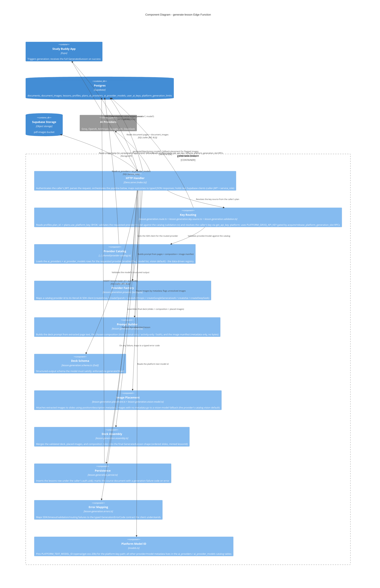

# C4 — Component Diagram: `generate-lesson` Edge Function

Level 3. Audience: developers. Zooms into the `generate-lesson` container from
[c4-containers.md](./c4-containers.md) — chosen because it is the richest container in the
system (key routing, prompt construction, structured-output validation, image placement, and
persistence all live here) and its internal seams matter for anyone changing generation
behavior.

Source: `supabase/functions/generate-lesson/index.ts` + `./_shared/*.ts`. Most pure modules are
hand-mirrored (or Jest-imported) from `libs/supabase-services/src/services/lesson-generation.*`;
edge-only seams include `lesson-generation.route.ts`, `lesson-generation.provider-factory.ts`,
`lesson-generation.validation.ts` (BYOK request validation), and `models.ts`.

## Notes

- **HTTP Handler is thin by design.** `index.ts` is intentionally orchestration-only glue; every
  decision (routing, prompt shape, schema, placement rule, error mapping) lives in a pure,
  unit-testable module — a Deno-testing-gap mitigation (Jest/Stryker can't run against the Deno
  runtime in this sandbox).
- **Two Supabase clients, two trust levels.** Document/lesson reads and the final insert use the
  caller-JWT client (RLS applies); profile/plan, catalog, key, and rate-limit reads use the
  service_role client because those RPCs and tables are deliberately unreachable from clients.
- **Key routing is plan-driven (R10).** BYOK callers must name a catalog provider/model
  (`invalid_model` / `provider_disabled` otherwise) and have a stored key (`missing_key`);
  platform-key callers are pinned to Groq + `PLATFORM_TEXT_MODEL_ID` and rate-limited per user
  via `acquire_platform_generation_slot` (5/min, 50/day → `rate_limited`), with the slot released
  in a `finally`.
- **Vision fallback is conditional, not always-on.** The vision-model call (one call for all
  flagged images, model = the provider's `is_vision_default` catalog row) only happens for
  images `placement` can't resolve from text metadata (R2's placement rule); slides with no
  resolvable image render text-only rather than failing the whole generation.
- **Composition enforcement isn't a separate component** — it's a parameter threaded through
  `promptBuilder` and validated again in `assembly`/`deckSchema`, per R2.1 (`instructional-only`
  / `activity-only` / `both`).
- **The whole pipeline runs under a 120 s timeout** (`timeout` error code) and never persists a
  partial deck — schema failures throw before `persist` runs.
- **`manage-api-key` and `extract-pdf` are simpler** (HTTP handler + a few pure modules each) and
  are not diagrammed separately — their responsibilities are already fully captured at the
  container level in [c4-containers.md](./c4-containers.md).
