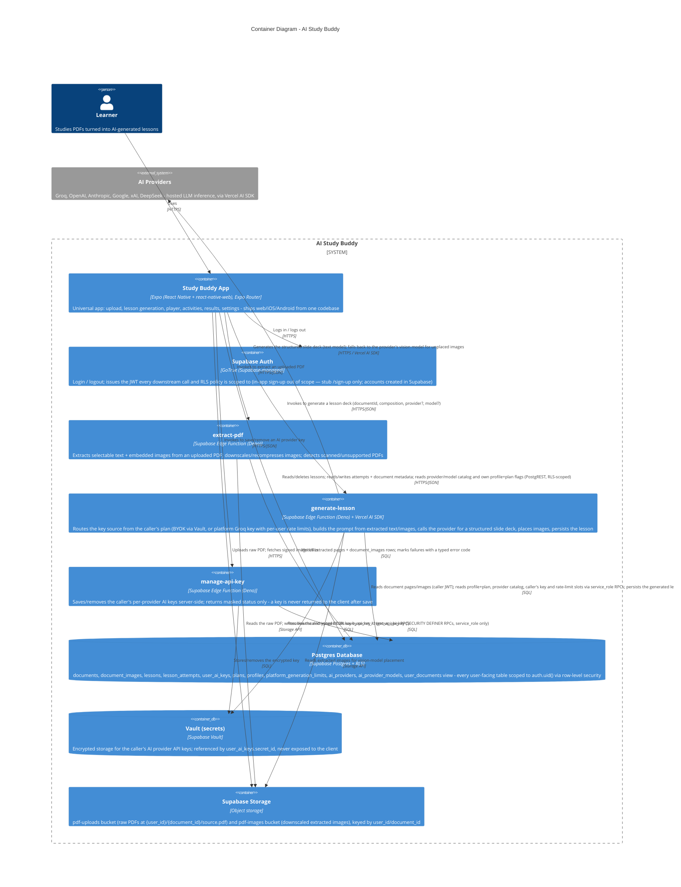

# C4 — Container Diagram: AI Study Buddy

Level 2. Audience: engineers, technical reviewers. Zooms into the `AI Study Buddy` system
boundary from [c4-context.md](./c4-context.md).

## Notes

- **Auth as a container, not glue.** `Supabase Auth` is drawn as its own container because
  every other container's data access is scoped by the JWT it issues (`auth.uid()` in RLS
  policies); it isn't an implementation detail of the app.
- **The client talks to Postgres directly for most CRUD.** Lesson attempts, document metadata,
  the provider/model catalog, and the caller's own profile+plan flags are read/written straight
  from the app via `@helsoft/supabase-services` DAOs (PostgREST under RLS). Lessons are
  **read/deleted** by the client; **inserts** come from `generate-lesson` under the caller JWT.
  Edge Functions are used only where server-side logic is required: extraction (parsing, image
  processing), generation (holding the AI key, calling the LLM), and API-key management (writing
  to Vault). This matches the "Component → Hook → Service → DAO" layering in `AGENTS.md`, just
  with two possible DAO backends (Postgres directly, or an Edge Function invocation) behind the
  same Service layer.
- **Entitlements are enforced server-side.** `generate-lesson` reads the caller's live
  `profiles.plan_id → plans.use_platform_key` flag with its service_role client and routes the
  key source accordingly: BYOK (per-provider key from Vault; missing → `missing_key`) or the
  platform Groq key gated by `acquire_platform_generation_slot` (5/min, 50/day per user →
  `rate_limited`). Clients cannot mutate `plan_id` (no UPDATE policy on `profiles`) and cannot
  call any of the key/slot RPCs (EXECUTE is service_role-only).
- **The provider catalog is data, not code.** `ai_providers`/`ai_provider_models` (read-only to
  authenticated users) drive the provider/model pickers in the app and are re-validated inside
  `generate-lesson` (unknown model → `invalid_model`, disabled provider → `provider_disabled`).
- **Three Edge Functions, three distinct responsibilities** — see
  [c4-components-generate-lesson.md](./c4-components-generate-lesson.md) for `generate-lesson`'s
  internals, the most complex of the three.
- **Vault is modeled as a separate container** from Postgres because it is a distinct trust
  boundary: `user_ai_keys` stores only a `secret_id` reference, and the actual key material never
  leaves Vault except inside the `generate-lesson` function's own process memory for the
  duration of one request.
- **No deployment/CI container yet.** R8 (GitHub Actions build + deploy for web) is not
  implemented (no `.github/workflows/`); web ships via a manual `expo export` + `eas deploy`
  script — this diagram reflects the system as built, not the target state.
