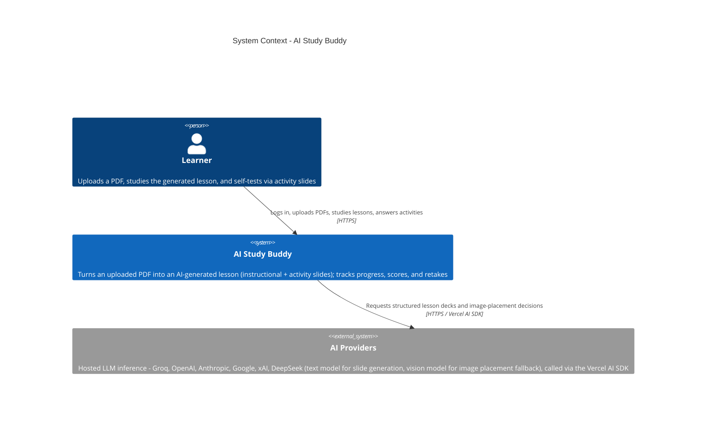

# C4 — System Context: AI Study Buddy

Level 1. Audience: everyone (product, engineering, reviewers).

AI Study Buddy turns an uploaded PDF into an AI-generated lesson of alternating instructional
and activity slides, so a learner can study material and self-test in one flow. Free-plan users
bring their own AI provider API key (bring-your-own-key, any of six catalog providers); the
paid plan uses a platform-held Groq key with per-user rate limits.

## Notes

- **Single system boundary.** The Expo app (web/iOS/Android) and its Supabase backend
  (Postgres, Auth, Storage, Edge Functions) are modeled as one system — `AI Study Buddy` — since
  this team owns the schema, RLS policies, and Edge Function code even though Supabase hosts it.
  See [c4-containers.md](./c4-containers.md) for that breakdown.
- **AI providers are the only external systems.** They are reached exclusively from the
  `generate-lesson` Edge Function — the client never calls them directly (R2, R6). A BYOK key
  is collected in Settings only long enough to POST to `manage-api-key`; after save it is never
  returned to the client and is never used client-side for LLM calls. Which provider is called
  is data-driven: BYOK users pick a provider/model from the `ai_providers`/`ai_provider_models`
  catalog tables; paid-plan (platform-key) requests are pinned to Groq.
- **In-app sign-up is out of scope for the MVP** (`user-stories/pending/sign-up.md`) — accounts
  are created in Supabase; the app ships login/logout plus a navigable stub `/sign-up` screen
  (no registration flow).
- **No other external integrations exist yet.** There is no email/notification provider, no
  payment provider, and no analytics SaaS in the current codebase — the PRD's success metrics
  (§ Success Metrics) are intended to be instrumented but no third-party analytics system is
  wired up as of this writing.
