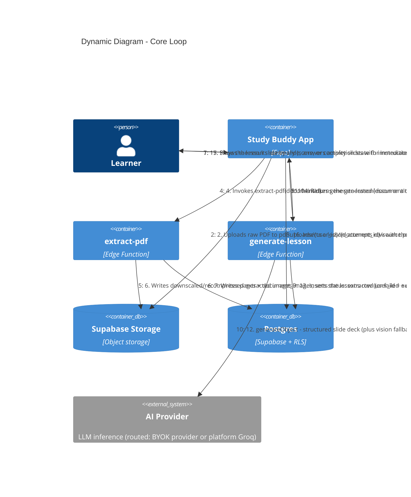

# C4 — Dynamic Diagram: Core Loop (Upload → Generate → Study → Score)

Audience: engineers, technical reviewers. Traces the PRD's headline flow — "upload → generate →
study → score" — across the containers from [c4-containers.md](./c4-containers.md), in call
order. Assumes the learner is already authenticated and either has a BYOK provider key saved or
is on the paid plan (platform key) — see `c4-components-generate-lesson.md` for
`manage-api-key` and key routing, not repeated here.

## Notes

- **Steps 1-8 (extraction) and 9-14 (generation) are two independent Edge Function round-trips**,
  not one call — the client owns the state transition between them and can retry a failed
  generation from the pending-PDFs list (`user_documents` view) without re-uploading or
  re-extracting.
- **Step 11 is the plan-based key routing** (R10): `profiles.plan_id → plans.use_platform_key`
  decides between the caller's BYOK key (Vault, `get_api_key`) and the platform Groq key
  (gated by `acquire_platform_generation_slot`, 5/min and 50/day per user).
- **Step 12 is itself two possible LLM calls** (text model, then a conditional vision-model call)
  — see [c4-components-generate-lesson.md](./c4-components-generate-lesson.md) for that detail;
  this diagram keeps generation as one logical step to stay readable end-to-end.
- **Steps 15-17 (player, activities, scoring) do not go through any Edge Function** — the app
  talks to Postgres directly (RLS-scoped) to persist the attempt, matching R7. In-session
  answers live in the player's reducer only; **mid-lesson resume (R9) is not implemented** —
  it remains a pending story (`user-stories/pending/resume-mid-lesson.md`), so closing the app
  mid-lesson restarts it from the first slide.
- Everything after step 1 assumes the learner is authenticated (`Supabase Auth`, per
  [c4-containers.md](./c4-containers.md)) — omitted here to keep the flow scoped to the core loop.
