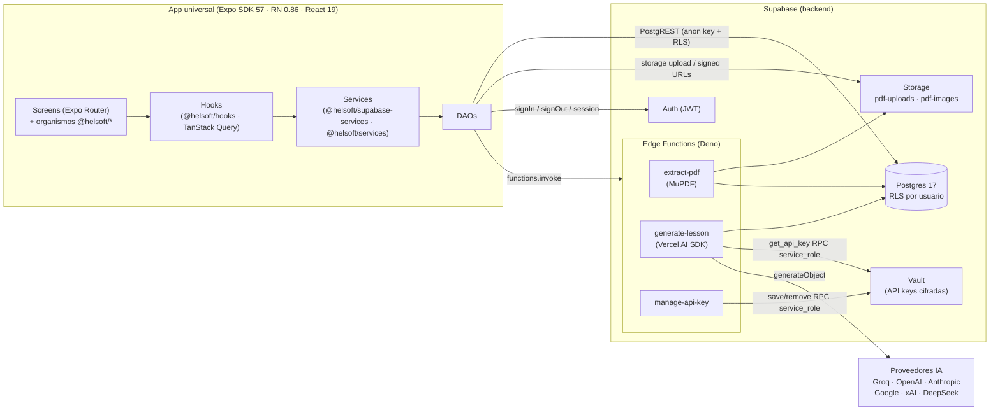
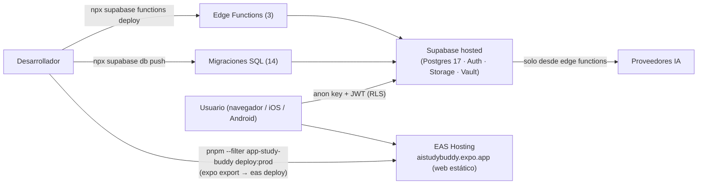
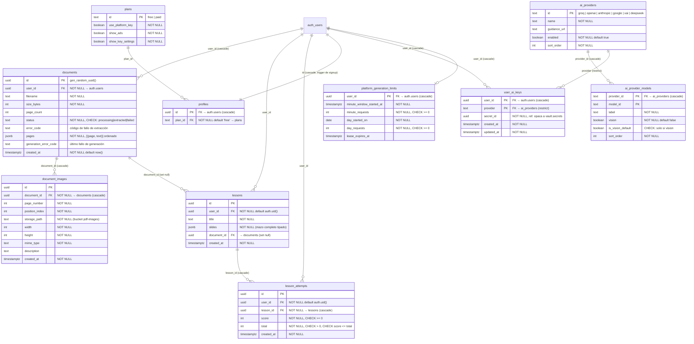

## Índice

0. [Ficha del proyecto](#0-ficha-del-proyecto)
1. [Descripción general del producto](#1-descripción-general-del-producto)
2. [Arquitectura del sistema](#2-arquitectura-del-sistema)
3. [Modelo de datos](#3-modelo-de-datos)
4. [Especificación de la API](#4-especificación-de-la-api)
5. [Historias de usuario](#5-historias-de-usuario)
6. [Tickets de trabajo](#6-tickets-de-trabajo)
7. [Pull requests](#7-pull-requests)

---

## 0. Ficha del proyecto

### **0.1. Tu nombre completo:**

Hernán Laura

### **0.2. Nombre del proyecto:**

AI Study Buddy

### **0.3. Descripción breve del proyecto:**

AI Study Buddy convierte cualquier PDF en una lección interactiva generada por IA. El usuario sube un PDF, el backend extrae su texto e imágenes, y un modelo de lenguaje genera un mazo de diapositivas que alternan contenido instructivo con actividades evaluables (opción múltiple, completar espacios, flashcards, emparejamiento y respuesta abierta). El alumno recorre la lección en un reproductor con progreso visible, responde las actividades en el momento y obtiene una puntuación final; los reintentos registran nuevas puntuaciones para medir la ganancia de aprendizaje. Una sola base de código (Expo universal) sirve web, iOS y Android, con Supabase como backend (auth, Postgres con RLS, storage, edge functions) y coste de IA controlado mediante *bring-your-own-key* multi-proveedor (Groq, OpenAI, Anthropic, Google, xAI, DeepSeek) o clave de plataforma para el plan de pago.

### **0.4. URL del proyecto:**

[https://aistudybuddy.expo.app](https://aistudybuddy.expo.app) (web, desplegado en EAS Hosting)

Credenciales de prueba: lidr@ai4devs.com / AI4Devs123

### 0.5. URL o archivo comprimido del repositorio

[https://github.com/rimbener/AI4Devs-finalproject](https://github.com/rimbener/AI4Devs-finalproject)

---


## 1. Descripción general del producto


### **1.1. Objetivo:**

Cualquier persona que necesite aprender o ser evaluada sobre el contenido de un PDF —un estudiante con un capítulo asignado, un profesional estudiando un manual o informe, alguien preparando un examen o certificación— se enfrenta al mismo problema: la lectura pasiva no fija el conocimiento y no existe una forma rápida de **aprender el material y comprobar si realmente se entendió**. Construir material de estudio a mano (diapositivas, cuestionarios, flashcards) es tedioso, así que la mayoría relee y confía en la suerte.

AI Study Buddy elimina ese trabajo: con una sola subida, el PDF se transforma en una lección generada por IA de diapositivas instructivas y de actividad, de modo que estudiar y autoevaluarse ocurre en un único flujo. Los objetivos del producto (PRD):

1. **De PDF a lección con una sola subida**, sin autoría manual.
2. **Contenido que demuestre que enseña**: la apuesta central es la *ganancia de aprendizaje*, medida como mejora de puntuación entre intentos (retakes) de una misma lección.
3. **Funcionar en todas partes desde una base de código**: web primero, iOS/Android compilables desde el mismo proyecto React Native + Expo.
4. **Coste de IA controlable**: los usuarios free traen su propia API key (coste variable ≈ 0); el plan de pago usa la clave de plataforma con límites de uso server-side.
5. **Ser un artefacto de portfolio limpio**: repo revisable con arquitectura real (auth, backend, testing, despliegue).


### **1.2. Características y funcionalidades principales:**

- **Subida de PDF con extracción server-side (R1)**: una edge function extrae el texto seleccionable y las imágenes embebidas de todas las páginas (reescaladas y recomprimidas a Storage, asociadas a su página/posición). Detecta PDFs escaneados/no soportados y aplica límites (10 MiB, 20 páginas) con errores claros. El cliente nunca parsea el PDF, así el comportamiento es idéntico en web, iOS y Android.
- **Generación de lección por IA (R2 + R2.1)**: el usuario elige la composición (`solo instructivas` / `solo actividades` / `ambas`, por defecto `ambas`) y una edge function llama al LLM mediante el Vercel AI SDK con salida estructurada validada por esquema (zod). Las imágenes extraídas se colocan en las diapositivas por metadatos de posición, con fallback a un modelo de visión; las referencias rotas degradan a solo-texto sin romper la generación.
- **Cinco tipos de actividad (R3)**: opción múltiple, completar espacios, flashcard, respuesta abierta (autoevaluada) y emparejamiento (tap-to-pair), todas con feedback inmediato y explicación.
- **Reproductor de lección (R4)**: una diapositiva a la vez, navegación Next/Back, barra de progreso + indicador "slide X de N", respuestas en sesión que se conservan al volver atrás, posibilidad de saltar actividades, y resultados como diapositiva final del mazo. Responsive web/móvil.
- **Persistencia y cuentas (R5/R5.1)**: login y logout con Supabase Auth (el registro in-app quedó fuera del alcance del MVP — historia en `user-stories/pending/sign-up.md`; las cuentas se crean desde Supabase; la app aún navega a un stub `/sign-up` sin flujo real); las lecciones se persisten server-side bajo el usuario autenticado (RLS `user_id = auth.uid()`), se listan en Home, se reabren y se borran con confirmación.
- **Gestión de PDFs pendientes**: lista de PDFs extraídos con su estado y la acción que corresponde (generar, reintentar tras fallo, abrir la lección producida, borrar), sin re-subir el archivo.
- **Puntuación y resultados (R7)**: resumen de aciertos al final; cada intento se guarda en `lesson_attempts` para medir la ganancia de aprendizaje entre reintentos.
- **BYOK multi-proveedor + registro de proveedores (R6/R10)**: la API key del usuario se guarda cifrada en Supabase Vault (nunca vuelve al cliente ni a logs); catálogo de proveedores/modelos en base de datos (Groq, OpenAI, Anthropic, Google, xAI, DeepSeek). Los flags de plan (`use_platform_key`, `show_key_settings`, `show_ads`) se aplican server-side, con rate-limiting por usuario para la clave de plataforma.
- **Internacionalización**: interfaz en inglés, español, alemán y portugués (i18next), con tests de paridad de locales.


### **1.3. Diseño y experiencia de usuario:**

El flujo E2E del usuario:

1. **Login** (`(auth)/login`): email + contraseña vía Supabase Auth; la sesión persiste entre aperturas de la app (registro in-app fuera de alcance — hay stub navegable en `/sign-up`; cuentas se crean desde Supabase).
2. **Home** (`(app)/(tabs)/index`): lista de lecciones guardadas del usuario (más reciente primero) con estado vacío para cuentas nuevas; tocar una lección la reabre en el reproductor.
3. **PDF Files** (`(app)/(tabs)/pdf-files`): subida del PDF (picker nativo/web), progreso de extracción, y la lista de PDFs con su acción contextual: *Generate* (elige composición, proveedor y modelo), *Retry* si la generación falló, o abrir la lección generada.
4. **Generación**: panel de progreso mientras la edge function genera el mazo; errores tipados legibles (clave inválida, rate limit, timeout…).
5. **Reproductor** (`(app)/lesson/[id]/player`): una diapositiva a la vez con imagen si la tiene, actividades respondibles in situ, progreso visible y resultados como última diapositiva, con opción de retake.
6. **Settings** (`(app)/(tabs)/settings`): idioma y gestión de API keys por proveedor (guardar/eliminar; solo se muestra estado enmascarado).

El sistema de diseño sigue Material Design 3 (tokens documentados en `.agents/DESIGN.md`): tipografías Sora e IBM Plex Sans/Mono, Material Symbols Rounded, y componentes organizados por atomic design. Cada componente compartido tiene su historia de Storybook — los Storybooks por librería (`pnpm dev`: components :6007, study-buddy :6008, activities :6009, logging-in-out :6010) sirven como catálogo visual navegable de toda la UI, incluidos los cinco organismos de actividad y el reproductor completo.

### **1.4. Instrucciones de instalación:**

Prerequisitos: Node 20+, pnpm 11.10.0, Docker Desktop (para el stack local de Supabase) y la CLI de Supabase (vía `npx supabase`).

```bash
git clone https://github.com/rimbener/AI4Devs-finalproject.git
cd AI4Devs-finalproject
pnpm install
```

**Variables de entorno** — copia `apps/app-study-buddy/.env.example` a `apps/app-study-buddy/.env`:

```
EXPO_PUBLIC_SUPABASE_URL=http://127.0.0.1:54321        # o https://<project-ref>.supabase.co
EXPO_PUBLIC_SUPABASE_ANON_KEY=<anon key de `supabase status`>
```

Las edge functions usan secretos server-side (`SUPABASE_SERVICE_ROLE_KEY`, `PLATFORM_GROQ_API_KEY`) configurados en Supabase, nunca en el cliente.

**Arranque en local (una orden)** — levanta Supabase local (migraciones + seed incluidos), escribe el `.env` y arranca Expo:

```bash
pnpm --filter app-study-buddy dev-with-supabase   # Docker → supabase start → expo start :8091
```

El seed (`supabase/seed.sql`) crea los planes `free`/`paid` y usuarios demo `test@free.com` / `test@paid.com` (contraseña `test123`). Para usar la generación por IA, guarda una API key de algún proveedor (p. ej. Groq, gratuita) en Settings → API keys.

**Comandos útiles** (raíz del repo, Turborepo):

```bash
pnpm dev            # app + storybooks
pnpm build          # build de todos los workspaces
pnpm lint           # Biome por workspace
pnpm check-types    # tsc --noEmit por workspace
pnpm test           # tests Jest de todos los workspaces
npx supabase migration new <nombre>   # cambios de esquema siempre por migración
npx supabase db push                  # aplicar migraciones al proyecto hosted
```

> **Nota:** Si en el futuro alguna librería de React Native falla con las `isolated dependencies` (que es el comportamiento por defecto de pnpm), la solución rápida es agregar la línea `nodeLinker: hoisted` en `pnpm-workspace.yaml`.

---


## 2. Arquitectura del Sistema


### **2.1. Diagrama de arquitectura:**




Es un **monorepo Turborepo** con una app Expo universal y toda la lógica en librerías `@helsoft/*`, sobre un backend **serverless de Supabase**. El frontend impone un patrón de capas estricto (**Component → Hook → Service → DAO**, regla `.agents/rules/hooks-service-dao.mdc`) y el backend concentra todo lo sensible en **edge functions** + **RLS**.

**Por qué esta arquitectura**: (1) una sola base de código TypeScript sirve web/iOS/Android, maximizando el alcance con el esfuerzo de un MVP; (2) Supabase da auth, Postgres, storage y funciones sin operar servidores, con seguridad declarativa (RLS) verificable por tests; (3) las capas + librerías por dominio hacen el código testeable unidad a unidad (los DAOs aíslan el SDK, los services son lógica pura, los hooks son integración React) y permiten trabajar con agentes de IA con reglas verificables por capa. **Sacrificios**: vendor lock-in razonable con Supabase, Deno para funciones queda fuera del harness Jest/Stryker (se testea con Deno test + smoke manual), y la lógica compartida entre libs y edge functions se espeja a mano en `_shared/`.

### **2.2. Descripción de componentes principales:**

- **App** `apps/app-study-buddy` — Expo SDK 57, Expo Router (rutas file-based: `(auth)/`, `(app)/(tabs)/`, `(app)/lesson/[id]/`), React Native 0.86, React 19 con React Compiler activado, react-native-unistyles para theming. La app solo compone organismos de las libs; la lógica de negocio vive en `@helsoft/study-buddy`.
- **Librerías UI** — `@helsoft/components` (atomic design MD3 + tokens de tema), `@helsoft/activities` (los cinco organismos de actividad + `LessonPlayer`), `@helsoft/logging-in-out` (formularios de auth prop-driven), cada una con Storybook, Jest, Playwright y Stryker.
- **Capa de datos cliente** — `@helsoft/hooks` (15 hooks; TanStack Query por defecto), `@helsoft/supabase-services` (DAOs/services de Supabase + `initSupabase`/`getSupabase`), `@helsoft/services` (DAOs no-Supabase: AsyncStorage para preferencias), `@helsoft/localization` (i18next, 4 idiomas), `@helsoft/types`, `@helsoft/js-utils`, `@helsoft/rn-utils`.
- **Edge Function** `extract-pdf` (Deno + MuPDF) — descarga el PDF de Storage, valida tamaño/páginas, extrae texto por página e imágenes embebidas (reescaladas a 1024px/JPEG q80), detecta PDFs escaneados y persiste `documents` + `document_images` bajo el JWT del llamante (RLS).
- **Edge Function** `generate-lesson` (Deno + Vercel AI SDK) — autentica, resuelve la fuente de la clave según el plan (BYOK desde Vault vía RPC `get_api_key`, o clave de plataforma con rate-limiting por usuario), construye el prompt con texto + manifiesto de imágenes, llama `generateObject` con esquema zod estricto, coloca imágenes (fallback a modelo de visión), y persiste la lección — todo con contrato de errores tipado.
- **Edge Function** `manage-api-key` (Deno) — guarda/elimina la API key del usuario en Supabase Vault mediante RPCs `SECURITY DEFINER` restringidas a `service_role`; responde solo estado enmascarado, con logging estructuralmente incapaz de filtrar la clave.
- **Postgres 17 + RLS** — 10 tablas + 1 vista, políticas por usuario en todas las tablas de datos, buckets privados con aislamiento por carpeta de usuario (detalle en §3).


### **2.3. Descripción de alto nivel del proyecto y estructura de ficheros**

```
AI4Devs-finalproject/
├── apps/app-study-buddy/       # app Expo universal (web + iOS + Android)
│   ├── src/app/                # rutas Expo Router: (auth)/, (app)/(tabs)/, (app)/lesson/[id]/
│   ├── src/lib/supabase.ts     # initSupabase() al arrancar
│   ├── tests/e2e/              # Playwright e2e contra la app real
│   └── scripts/                # dev.sh, deploy-web.sh, run-e2e.sh
├── libs/                       # todo el código compartido, paquetes @helsoft/*
│   ├── components/             # UI compartida (atomic design + Storybook)
│   ├── activities/             # organismos de actividad + lesson-player
│   ├── logging-in-out/         # organismos de auth prop-driven
│   ├── study-buddy/            # feature lib de la app (lógica de negocio)
│   ├── hooks/                  # hooks React (TanStack Query)
│   ├── supabase-services/      # DAOs + services Supabase + cliente
│   ├── services/               # DAOs + services no-Supabase (AsyncStorage)
│   ├── localization/           # i18next, recursos en/es/de/pt
│   └── types, js-utils, rn-utils, pdf-upload-extraction, lib-with-storybook
├── supabase/                   # backend: config.toml, migrations/ (14), functions/ (3), seed.sql
├── docs/architecture/          # diagramas C4 (contexto, contenedores, componentes, secuencia)
├── docs/features/<nombre>/     # bundle por feature: spec, gherkin, tasks, reviews, DoD
├── user-stories/               # historias: pending / in-progress / done (27 done)
├── .agents/                    # orquestador agéntico: roles, reglas .mdc, skills, DESIGN.md
├── PRD.md · prompts.md · readme.md
└── package.json · turbo.json · pnpm-workspace.yaml · biome.jsonc
```

Obedece a dos patrones: **monorepo por dominios** (la app es una cáscara; cada capacidad vive en una lib publicada como workspace package con el protocolo `workspace:*`) y **layering Hook→Service→DAO** dentro de las libs de datos. El desarrollo se gobernó con un **orquestador agéntico** (`.agents/`): cada feature pasó por spec + Gherkin con aprobación humana, TDD estricto por slices verticales, revisión por lentes, mutation testing y Definition of Done — los artefactos quedan en `docs/features/`.

### **2.4. Infraestructura y despliegue**




- **Frontend web**: `apps/app-study-buddy/scripts/deploy-web.sh` valida que `.env.production` apunte al proyecto hosted (rechaza URLs locales y variables ausentes), ejecuta `expo export --platform web` (salida estática) y `eas deploy` a EAS Hosting → [https://aistudybuddy.expo.app](https://aistudybuddy.expo.app). iOS/Android se compilan desde la misma base con EAS Build (proyecto EAS configurado en `app.json`).
- **Backend**: proyecto Supabase hosted enlazado desde `supabase/`; el esquema solo cambia por migraciones (`npx supabase migration new` + `db push`); las edge functions se despliegan con la CLI de Supabase y sus secretos (`PLATFORM_GROQ_API_KEY`, service role) viven en Supabase, nunca en el repo.
- **Entorno local completo**: `supabase start` (Docker) + seed reproducible, usado también por los tests e2e y de RLS.
- CI/CD con GitHub Actions (R8 del PRD) quedó fuera del alcance entregado; el despliegue es un script manual idempotente.


### **2.5. Seguridad**

- **RLS en todas las tablas de usuario**: `documents`, `document_images`, `lessons`, `lesson_attempts`, `profiles`, `user_ai_keys` — políticas `auth.uid() = user_id` (p. ej. `supabase/migrations/20260714012201_create_lessons_and_lesson_attempts_fk.sql`). `platform_generation_limits` tiene RLS sin políticas: solo accesible vía RPCs `SECURITY DEFINER`. Hay **tests de integración de RLS** contra Postgres real (`libs/supabase-services/src/dao/profiles.rls.integration.test.ts`).
- **Storage privado con aislamiento por usuario**: buckets `pdf-uploads` y `pdf-images` no públicos; políticas `(storage.foldername(name))[1] = auth.uid()::text`; las imágenes se sirven por signed URLs.
- **API keys en Supabase Vault**: `user_ai_keys` guarda solo un `secret_id`; las RPCs `save_api_key`/`get_api_key`/`remove_api_key` son `SECURITY DEFINER` con `EXECUTE` restringido a `service_role` — el cliente no puede invocarlas. La clave nunca vuelve al cliente tras guardarse y el logger de `manage-api-key` es estructuralmente incapaz de registrarla (cubierto por `logger.test.ts`).
- **El cliente solo usa la anon key**: todo acceso a datos pasa por PostgREST bajo RLS; la `service_role` key existe únicamente dentro de las edge functions, que autentican cada request con `auth.getUser()` sobre el JWT del header.
- **Entitlements server-side**: `generate-lesson` decide la fuente de la clave leyendo `profiles.plan_id → plans.use_platform_key` en vivo — el cliente no puede forzar la clave de plataforma ni mutar su plan (sin política de UPDATE en `profiles`) — y aplica rate-limiting por usuario (5/min, 50/día) a la clave de plataforma.
- **Validación de entrada y límites**: guard server-side de tamaño (10 MiB) y páginas (20) en `extract-pdf`; esquemas zod estrictos para la salida del LLM (sin mazo parcial/corrupto persistido); allowlist de CORS explícita en `_shared/cors.ts`; contrato de errores tipado sin filtrar detalles internos.
- **Higiene de secretos**: `.gitignore` excluye `.env`* (salvo `.env.example`) y certificados; `deploy-web.sh` se niega a desplegar apuntando a localhost; `seed.sql` (usuarios demo) advierte explícitamente no subirse al proyecto hosted.


### **2.6. Tests**

El desarrollo fue **TDD estricto** gobernado por el orquestador (`.agents/rules/tdd.mdc`); la suite tiene cuatro niveles:

- **Unitarios e integración (Jest)** — 286 archivos de test en 14 workspaces (preset `jest-expo` para libs RN, `ts-jest` para libs puras). Cubren reducers (`use-lesson-generation.reducer.test.ts`), services/DAOs con el SDK mockeado, componentes con Testing Library, paridad de locales (`player-locale-parity.test.ts`) e integración de hooks con TanStack Query (`lessons.integration.test.ts`). `pnpm test` los ejecuta todos vía Turborepo.
- **Integración RLS contra Postgres real** — proyectos Jest separados (`test:rls`) que levantan el stack local de Supabase y verifican que un usuario no puede leer/borrar filas de otro (p. ej. `pdf-upload.rls.integration.test.ts`).
- **End-to-end (Playwright)** — dos suites: (1) e2e de componentes contra Storybook en 5 libs, solo de interacción por regla (`.agents/rules/e2e.mdc`); (2) **e2e de la app real** (`apps/app-study-buddy/tests/e2e/`): `login.e2e.js`, `pdf-upload-and-generate.e2e.js` y `lesson-player.e2e.js` cubren el flujo principal completo — login real, subida del fixture `golden-path.pdf`, extracción MuPDF real contra Supabase local, y recorrido del reproductor hasta resultados; solo la llamada al LLM se mockea con `page.route()` para evitar coste/flakiness. `pnpm --filter app-study-buddy test:e2e` prepara y limpia la base automáticamente.
- **Mutation testing (StrykerJS)** — 9 configs con umbral `break: 100`: la política por feature fue matar el 100% de los mutantes en las líneas cambiadas (los PRs registran scores 97–100%). Además, las edge functions tienen tests Deno propios (`manage-api-key/*.test.ts`).

---


## 3. Modelo de Datos


### **3.1. Diagrama del modelo de datos:**




Existe además la vista `user_documents` (`security_invoker = on`, respeta RLS): join lateral de `documents` extraídos con su lección más reciente; alimenta la lista de PDFs pendientes (estado derivado: con `lesson_id` → generado; con `generation_error_code` → fallido; si no → listo para generar).

### **3.2. Descripción de entidades principales:**

- `documents` — un PDF subido y su resultado de extracción. `status` avanza `processing → extracted | failed` (CHECK); `pages` guarda el texto por página como jsonb ordenado; `error_code` y `generation_error_code` distinguen fallo de extracción vs. de generación. RLS: select/insert/update/delete solo del propio usuario. El binario vive en el bucket privado `pdf-uploads/{user_id}/{document_id}/source.pdf`.
- `document_images` — imágenes embebidas extraídas del PDF, con su `page_number`/`position_index` (para el anclaje a diapositivas), dimensiones, mime type y `storage_path` en el bucket `pdf-images`. FK a `documents` con cascade; índice por `document_id`; RLS vía `EXISTS` sobre el documento padre.
- `lessons` — la lección generada: `title` + `slides` (jsonb con el mazo completo tipado: diapositivas instructivas y de actividad con sus respuestas correctas y explicaciones). `user_id` toma `auth.uid()` por defecto (el cliente nunca lo envía); `document_id` con `ON DELETE SET NULL` conserva la lección si se borra el PDF. RLS select/insert/delete propias; **sin política de UPDATE**: las lecciones son inmutables.
- `lesson_attempts` — cada intento de una lección: `score`/`total` con CHECKs (`score >= 0`, `total > 0`, `score <= total`); base de la métrica de ganancia de aprendizaje. FK real a `lessons` con `ON DELETE CASCADE` (borrar una lección borra sus intentos). RLS insert/select propias, inmutable una vez escrito.
- `plans` **/** `profiles` — entitlements: `plans` define los flags (`use_platform_key`, `show_ads`, `show_key_settings`); `profiles` asigna un plan por usuario (default `free`) y se crea automáticamente con el trigger `on_auth_user_profile_created` cuando el usuario se da de alta en Supabase Auth. El cliente solo puede leer (su perfil y el catálogo de planes); los cambios de plan son manuales vía dashboard.
- `user_ai_keys` — PK compuesta `(user_id, provider)`: máx. una clave por proveedor y usuario. No contiene material secreto: solo `secret_id` hacia Supabase Vault. Escrituras exclusivamente vía RPCs `service_role` (`save_api_key`/`remove_api_key`); el cliente solo puede leer `provider, updated_at` (estado enmascarado). FK a `ai_providers` con `RESTRICT` (no se puede eliminar un proveedor con claves).
- `platform_generation_limits` — rate-limiting del plan de pago: ventana por minuto + contador diario UTC + lease anti-concurrencia (`acquire_platform_generation_slot`: rechaza con lease activo, ≥5/min o ≥50/día). Inaccesible para clientes (RLS sin políticas); solo las RPCs `SECURITY DEFINER`.
- `ai_providers` **/** `ai_provider_models` — catálogo data-driven de proveedores y modelos (13 modelos seed): flags `enabled`, `vision`, y `is_vision_default` con índice parcial único (máx. un modelo de visión por defecto por proveedor) + CHECK (un default de visión debe ser vision-capable). Solo lectura para usuarios autenticados; se administra por SQL.

---


## 4. Especificación de la API

El backend expone tres edge functions (además del acceso PostgREST bajo RLS). Todas requieren `Authorization: Bearer <JWT>`.

```yaml
openapi: 3.0.3
info:
  title: AI Study Buddy — Edge Functions
  version: 1.0.0
servers:
  - url: https://<project-ref>.supabase.co/functions/v1
paths:
  /extract-pdf:
    post:
      summary: Extrae texto e imágenes de un PDF ya subido a Storage
      security: [{ bearerAuth: [] }]
      requestBody:
        required: true
        content:
          application/json:
            schema:
              type: object
              required: [documentId]
              properties:
                documentId: { type: string, format: uuid }
      responses:
        '200':
          description: Extracción completada; documents.status pasa a 'extracted'
          content:
            application/json:
              schema:
                type: object
                properties:
                  documentId: { type: string, format: uuid }
                  filename: { type: string }
                  pageCount: { type: integer }
                  imageCount: { type: integer }
                  pages:
                    type: array
                    items:
                      type: object
                      properties:
                        page: { type: integer }
                        text: { type: string }
                  images:
                    type: array
                    items:
                      type: object
                      properties:
                        id: { type: string, format: uuid }
                        pageNumber: { type: integer }
                        positionIndex: { type: integer }
                        storagePath: { type: string }
                        width: { type: integer }
                        height: { type: integer }
                        mimeType: { type: string }
        '401': { description: 'unauthenticated' }
        '404': { description: 'extraction_failed (documento inexistente / no visible bajo RLS)' }
        '422':
          description: >-
            errorCode: file_too_large | corrupt_or_unreadable |
            too_many_pages | scanned_or_image_only
        '500': { description: 'extraction_failed (fallo interno de extracción)' }
  /generate-lesson:
    post:
      summary: Genera la lección por IA desde un documento extraído y la persiste
      security: [{ bearerAuth: [] }]
      requestBody:
        required: true
        content:
          application/json:
            schema:
              type: object
              required: [documentId, composition]
              properties:
                documentId: { type: string, format: uuid }
                composition:
                  type: string
                  enum: [instructional-only, activity-only, both]
                provider: { type: string, description: 'BYOK: id del catálogo (groq, openai…)' }
                model: { type: string, description: 'BYOK: modelo del catálogo' }
      responses:
        '200':
          description: Lección generada y persistida en `lessons`
          content:
            application/json:
              schema:
                type: object
                properties:
                  lessonId: { type: string, format: uuid }
                  title: { type: string }
                  composition: { type: string }
                  slides:
                    type: array
                    description: >-
                      Unión discriminada por `kind`: 'instructional' |
                      'activity' (activityType: multiple-choice | matching |
                      fill-in-the-blank | open-ended | flashcard), con campos
                      por tipo (options/correctOptionId, correctPairs,
                      acceptedAnswers, modelAnswer, back, explanation) e
                      imagen opcional {imageId, storagePath, width, height, alt}
        '400': { description: 'document_not_ready (JSON inválido / documentId o composition inválidos)' }
        '401': { description: 'unauthenticated | invalid_key' }
        '422': { description: 'document_not_ready (doc no extracted) | missing_key | invalid_model | provider_disabled' }
        '429': { description: 'rate_limited (límites de clave de plataforma)' }
        '500': { description: 'persist_failed | generation_failed (routing: plan flags nulos; sin mazo parcial)' }
        '502': { description: 'generation_failed (fallo de esquema/LLM; sin mazo parcial persistido)' }
        '503': { description: 'platform_key_unavailable' }
        '504': { description: 'timeout (120 s)' }
  /manage-api-key:
    post:
      summary: Guarda o elimina la API key BYOK del usuario (Supabase Vault)
      security: [{ bearerAuth: [] }]
      requestBody:
        required: true
        content:
          application/json:
            schema:
              oneOf:
                - type: object
                  required: [action, provider, apiKey]
                  properties:
                    action: { type: string, enum: [save] }
                    provider: { type: string }
                    apiKey: { type: string }
                - type: object
                  required: [action, provider]
                  properties:
                    action: { type: string, enum: [remove] }
                    provider: { type: string }
      responses:
        '200':
          description: Estado enmascarado de todas las claves (nunca el material)
          content:
            application/json:
              schema:
                type: object
                properties:
                  keys:
                    type: array
                    items:
                      type: object
                      properties:
                        provider: { type: string }
                        updatedAt: { type: string, format: date-time }
        '400': { description: 'validation_error | provider_disabled | network_error (body malformado)' }
        '401': { description: 'network_error (fallo de autenticación)' }
        '502': { description: 'network_error (fallo al guardar/leer catálogo o Vault)' }
components:
  securitySchemes:
    bearerAuth: { type: http, scheme: bearer, bearerFormat: JWT }
```

**Ejemplo — `POST /functions/v1/generate-lesson`:**

```json
// Request
{ "documentId": "8f14e45f-…", "composition": "both", "provider": "groq", "model": "openai/gpt-oss-20b" }

// Response 200 (abreviada)
{
  "lessonId": "c9b1a2d3-…",
  "title": "Fotosíntesis: conceptos clave",
  "composition": "both",
  "slides": [
    { "id": "s1", "kind": "instructional", "position": 0,
      "title": "¿Qué es la fotosíntesis?", "content": "…",
      "image": { "imageId": "…", "storagePath": "…/p1-0.jpg", "width": 800, "height": 600 } },
    { "id": "s2", "kind": "activity", "activityType": "multiple-choice", "position": 1,
      "title": "Comprueba lo aprendido", "content": "¿Dónde ocurre la fase luminosa?",
      "options": [ { "id": "a", "text": "Tilacoides" }, { "id": "b", "text": "Estroma" } ],
      "correctOptionId": "a", "explanation": "…" }
  ]
}

// Error
{ "errorCode": "missing_key" }   // 422
```

---


## 5. Historias de Usuario

Las 27 historias completadas viven en `user-stories/done/`, mapeadas a los requisitos del PRD (R1–R10) y trazadas a su bundle en `docs/features/<nombre>/`. Las tres principales del flujo E2E:

**Historia de Usuario 1 — Subida de PDF y extracción de contenido en backend (R1)** · `user-stories/done/pdf-upload-extraction.md`

> **Como** estudiante, **quiero** subir un PDF y que el backend extraiga su texto legible e imágenes embebidas, **para** tener todo lo necesario para generar una lección desde él, sin depender del dispositivo o plataforma que use.

Criterios de aceptación (resumen): el backend procesa **todas** las páginas extrayendo texto seleccionable e imágenes embebidas; las imágenes se reescalan/recomprimen, se persisten en Storage y quedan asociadas a su página/posición; páginas mixtas (solo texto, texto+imagen, solo figura) se capturan en orden de documento; la extracción vive server-side (edge function) para comportamiento idéntico en web/iOS/Android; un PDF escaneado o no soportado produce un error claro; un archivo sobre el límite de tamaño se rechaza con mensaje claro. *Fuera de alcance: OCR de PDFs escaneados.*

**Historia de Usuario 2 — Generación de lección por IA con elección de composición (R2 + R2.1)** · `user-stories/done/ai-lesson-generation.md`

> **Como** estudiante, **quiero** elegir qué debe contener mi lección y que la IA la genere desde mi PDF subido, **para** obtener un mazo estructurado de diapositivas instructivas y/o de actividad, sin que mi clave salga nunca del servidor.

Criterios de aceptación (resumen): composición por defecto `both`, con opciones `instructional only`/`activity only` que se pasan a la edge function y se **aplican** en el resultado; la salida es una lista ordenada de diapositivas tipadas; la llamada al proveedor ocurre dentro de la edge function vía Vercel AI SDK, con la clave leída server-side y nunca expuesta al cliente ni a logs; los metadatos de imagen dirigen su colocación (con modelo de visión como fallback) y las referencias rotas degradan a solo-texto; cada actividad es de uno de los cinco tipos con su respuesta correcta y explicación; progreso visible durante la generación; ante fallo (clave inválida, rate limit, timeout, respuesta malformada) el usuario ve un error legible y **no se persiste un mazo parcial o corrupto**.

**Historia de Usuario 3 — Reproductor de lección con navegación por diapositivas (R4)** · `user-stories/done/lesson-player.md`

> **Como** estudiante, **quiero** un reproductor que muestre mi lección generada una diapositiva a la vez —con su imagen si la tiene y su componente de actividad si es de actividad— con progreso visible y navegación adelante/atrás, **para** recorrer el mazo a mi ritmo, en web o móvil, y responder las actividades en el momento antes de llegar a mis resultados.

Criterios de aceptación (resumen): exactamente una diapositiva a la vez empezando por la primera; Next/Back con Back deshabilitado en la primera; las instructivas muestran título y contenido, las de actividad su componente respondible; las imágenes asociadas se renderizan escaladas al viewport y las referencias fallidas degradan a solo-texto sin error visible; progreso como barra + "slide X de N"; volver a una actividad respondida conserva su estado en sesión; avanzar tras la última diapositiva lleva a resultados con las respuestas calificadas reales; layout responsive web/móvil.

---


## 6. Tickets de Trabajo

Cada historia se descompuso en tickets atómicos (`docs/features/<nombre>/task-N.md`) con trazabilidad a escenarios Gherkin (`@sN` en `gherkin-scenarios.md`). Un ejemplo de cada tipo:

**Ticket 1 (Backend)** — `generate-lesson` Edge Function: happy path de composición `both` + spike Groq/AI-SDK · `docs/features/ai-lesson-generation/task-4.md`

- **Contexto**: primera llamada a un LLM del repo; slice 1 de la feature `ai-lesson-generation` (historia R2); escenarios `@s3, @s6, @s7, @s8, @s9, @s11, @s13`.
- **Descripción**: implementar el happy path de la edge function `generate-lesson`: autenticar al llamante (JWT), leer `documents.pages` + `document_images` bajo RLS, leer la clave descifrada vía RPC `get_api_key` (service_role), construir un prompt que **aplique** la composición, llamar a Groq vía `@ai-sdk/groq` con `generateObject(deckSchema)`, anclar imágenes por metadatos de página/posición y validar la salida en un `GeneratedLesson` tipado con `lessonId` acuñado.
- **Detalle técnico**: la lógica pura vive testeable con Jest en `@helsoft/supabase-services` y se espeja en `_shared/` de la función — `lesson-generation.prompt.ts` (prompt desde texto por página + composición + manifiesto de imágenes sin bytes), `lesson-generation.schema.ts` (esquema zod estricto con invariantes: `correctOptionId ∈ options[].id`, emparejamiento perfecto en matching), `lesson-generation.placement.ts` (anclaje por metadatos), `lesson-generation.assembly.ts` (validación, orden, `position`, `SlideImageRef`); `index.ts` queda como glue fino (auth, dos clientes Supabase, lecturas, llamada al SDK, respuesta JSON). El cliente envía `{ documentId, composition }` y, en BYOK, también `provider` y `model`.
- **Criterios de done**: salida que no cumple el esquema → `GenerationSchemaError` (sin mazo parcial); IDs de modelo centralizados en `_shared/models.ts`; todos los módulos `deno check` limpios; TDD estricto (tests primero por escenario).

**Ticket 2 (Frontend)** — Mazo del `LessonPlayer`: navegación, progreso y resultados como diapositiva final · `docs/features/lesson-player/task-4.md`

- **Contexto**: slice 1 de la feature `lesson-player` (historia R4); escenarios `@s1–@s4, @s10, @s11, @s17, @s20`.
- **Descripción**: el organismo `LessonPlayer` renderiza exactamente un paso a la vez con `ProgressIndicator` (barra + "slide X de N") y controles Next/Back. El mazo tiene `N = contentSlides.length + 1` pasos: las diapositivas de contenido en `0..M-1` (vía `SlideView`) y una **diapositiva terminal de resultados** en `M` — decisión de diseño registrada: resultados es la última diapositiva del mazo, no una ruta aparte, para que Back funcione desde ella.
- **Detalle técnico**: `use-lesson-player` posee el estado con un reducer (`currentIndex` + respuestas por diapositiva) y transiciones nombradas `next`/`back`/`answer`/`reset`; invariantes explícitas: se empieza en 0, Back deshabilitado en 0 y habilitado en resultados (→ `M-1`), **Next nunca bloquea por falta de respuesta** (saltar permitido), Next oculto en resultados, resultados es "slide N de N". Ficheros: `libs/components/src/atoms/progress-indicator/`, `libs/activities/src/organisms/lesson-player/` (tsx + types + hook + reducer + stories + test), y la pantalla `apps/app-study-buddy/src/app/(app)/lesson/[id]/player.tsx` (carga con `useLesson(id)`, estados Loading/Content).
- **Criterios de done**: reducer y componente con tests unitarios (estados Empty/Error en slice 3); historia de Storybook; cumplimiento de las reglas `component-split.mdc` y `state.mdc`.

**Ticket 3 (Base de datos)** — Migración: tabla `lessons` + RLS + FK en `lesson_attempts` · `docs/features/signup-and-lesson-persistence/task-1.md`

- **Contexto**: slice 1 de la feature `signup-and-lesson-persistence` (historia R5); escenarios `@s10, @s11, @s12`; área `supabase/migrations/`.
- **Descripción**: crear `public.lessons` espejando el modelo de seguridad de `lesson_attempts`: `id uuid pk default gen_random_uuid()`, `user_id uuid not null default auth.uid() references auth.users(id)`, `title text not null`, `slides jsonb not null`, `created_at timestamptz not null default now()`. Habilitar RLS con políticas `select`/`insert`/`delete` con alcance `user_id = auth.uid()` (el cliente nunca establece `user_id`); `grant select, insert, delete to authenticated`. Después, aterrizar la FK diferida: `lesson_attempts.lesson_id → lessons.id` con `ON DELETE CASCADE` (borrar una lección elimina sus intentos), manejando posibles filas huérfanas preexistentes para que la FK pueda añadirse.
- **Criterios de done**: RLS de `lessons` espeja `lesson_attempts` (`with check`/`using` = `auth.uid()`); FK `lesson_attempts_lesson_id_fkey` con cascade; migración creada con `npx supabase migration new` — ningún cambio de esquema fuera de migraciones; la migración no falla ante huérfanos (decisión documentada en el comentario de la migración). Sin código de libs en este ticket (solo esquema); el tipado cliente llega en task-3.
- **Criterios de aceptación (Gherkin)**: `@s10` borrar una lección elimina sus intentos vía FK real; `@s11` el usuario B o una petición no autenticada no ven lecciones del usuario A; `@s12` el usuario B no puede borrar lecciones del usuario A.

---


## 7. Pull Requests

El trabajo se integró en el fork mediante 14 PRs de feature (11 merged). Los tres más significativos del flujo principal:

**Pull Request 1** — `feat(ai-lesson-generation): PDF → AI-generated lesson (Groq)` · [rimbener/AI4Devs-finalproject#2](https://github.com/rimbener/AI4Devs-finalproject/pull/2) · rama `feat/ai-lesson-generation` · +6.822/−116 en 120 archivos

Añade la edge function `generate-lesson` que convierte un documento extraído (R1) en un mazo de diapositivas generado por IA sobre Groq, respetando las tres composiciones, más el stack cliente completo `LessonGenerationDao → LessonGenerationService → useLessonGeneration → GenerationProgress → LessonGenerationPanel` conectado a la pantalla de subida. Incluye un contrato de errores tipado end-to-end (`missing_key`/`invalid_key`/`rate_limited`/`timeout`/`generation_failed`/…), fallback de modelo de visión para imágenes sin anclaje, degradación a solo-texto, i18n en 4 idiomas y pase de accesibilidad. Evidencia del pipeline en el cuerpo del PR: 15 tickets en 3 slices verticales con TDD estricto, mutation score 98,18% post-review, revisión multi-lente aprobada tras 2 rondas, DoD PASS.

**Pull Request 2** — `Feat/lesson persistence` · [rimbener/AI4Devs-finalproject#4](https://github.com/rimbener/AI4Devs-finalproject/pull/4) · rama `feat/signup-and-lesson-persistence` · +4.288/−298 en 99 archivos

Aterriza R5 en tres slices: (1) el backend de persistencia y lectura — la migración de la tabla `lessons` con RLS + la FK diferida `lesson_attempts.lesson_id`, y su DAO/service; (2) la lista real de lecciones en Home con el flujo de reapertura, reemplazando el stub; (3) borrado con confirmación y el reintento ante `persist_failed`. La ronda 2 de review corrigió accesibilidad, `FlatList` y un guard de migración; pases de mutación pre y post-review con todos los mutantes supervivientes eliminados antes del DoD.

**Pull Request 3** — `feat(lesson-player): slide-by-slide player with inline results` · [rimbener/AI4Devs-finalproject#6](https://github.com/rimbener/AI4Devs-finalproject/pull/6) · rama `feat/lesson-player` · +5.425/−164 en 111 archivos

Sustituye el stub del reproductor por el mazo real: carga la lección persistida, renderiza una diapositiva a la vez (instructivas, los cinco organismos de actividad de R3 e imágenes por signed URL), navegación Next/Back, indicador de progreso y salto de actividades permitido. El cambio de diseño clave: los resultados pasan a ser la **última diapositiva del mazo** en vez de una ruta aparte, de modo que Back funciona desde ellos; las actividades sin responder puntúan como incorrectas, el intento se guarda exactamente una vez por sesión y el retake limpia el estado en sesión. Cubre además vacío/error de carga/degradación de imagen/responsive/i18n+a11y; DoD PASS con mutation score 100% pre y post-review.
